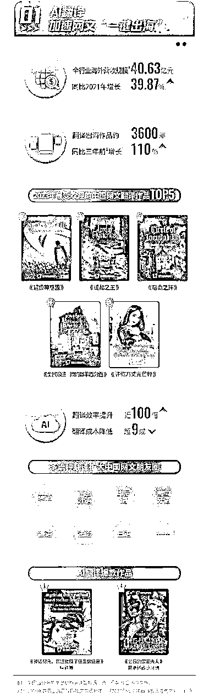
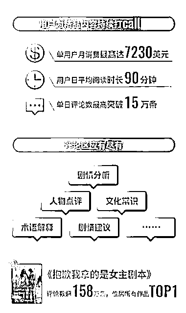

# 海外网文 AI 翻译-撰写，网络作家成海外热门兼职

> 原文：[`www.yuque.com/for_lazy/xkrm14/hzn9uzrfk67y7g7f`](https://www.yuque.com/for_lazy/xkrm14/hzn9uzrfk67y7g7f)

作者： 张波

日期：2023-12-07

点赞数：**73**

* * *

正文：

标# 海外网文 AI 翻译/撰写，网络作家已成海外热门兼职 目前市场：
截至 2023 年 10 月，起点国际培养了约 40 万名海外网络作家。网络作家已成海外热门兼职，作家数量 3 年增 3 倍，爆发式增长态势明显。海外网络作家覆盖全球 100 多个国家和地区，其中，美国网络作家数量居于首位。为了让全球“催更”读者更快更全面地感受中国网文的魅力，满足不断增长的阅读需求，阅文集团在今年加大 AIGC 技术的布局，持续升级人机配合的 AI 翻译模式。在 AI 助力下，网文的翻译效率提升近百倍，成本降低超九成。比如，中译英的《神话纪元，我进化成了恒星级巨兽》、英语译西班牙语的《公爵的蒙面夫人》等多部 AI 翻译作品已成畅销作品。
海外语言：
起点国际将启动多语种发展计划，借助 AI 翻译上线英语、西班牙语、印尼语、葡萄牙语、德语、法语、日语等多个语种。随着新技术应用的持续深化，“一键出海”、全球追更已经成为翻译出海的新趋势。
内容题材：
海外网文作品已形成 15 个大类 100 多个小类，都市、西方奇幻、东方奇幻、游戏竞技、科幻成为前五大题材类型。创作偏好方面，海外女性作家更爱写爱情喜剧、复仇文和悬疑爱情，男性作家更爱写冒险故事、系统文和成长升级。比如，《寻迹旧爱》是一部爱情喜剧，《继承至尊遗产的我》则是典型的成长升级文。
主要商机： 用 gpt 模仿国内的网文，然后借助 AI 翻译上线英语、西班牙语、印尼语、葡萄牙语、德语、法语、日语等多个语种。赚老外的钱。

* * *

评论区：

倪大胖 : 文化输出走起哈哈

一时 : 波哥 牛

a 飛 : 有没有赚钱的点

* * *

