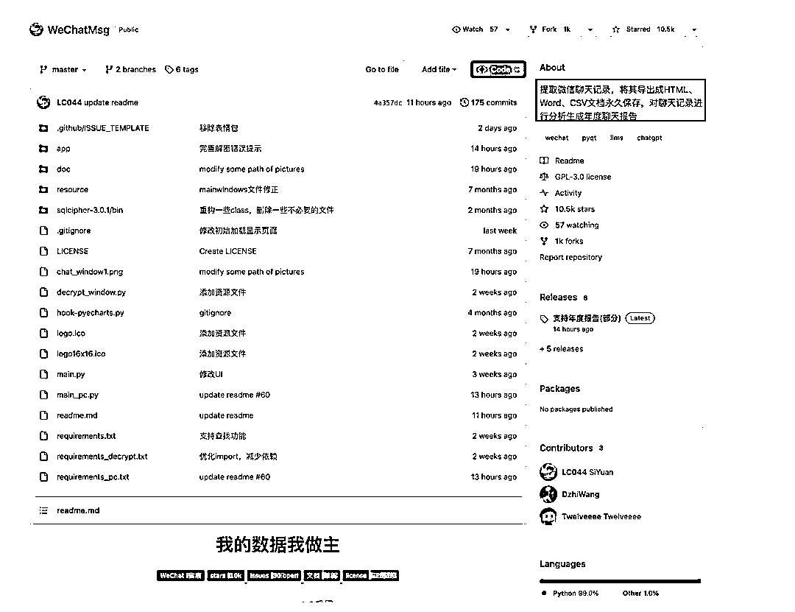

# GitHub 最近暴涨 1w 🌟项目：提取微信聊天记录

> 原文：[`www.yuque.com/for_lazy/xkrm14/sp9q5oligb3ngqb9`](https://www.yuque.com/for_lazy/xkrm14/sp9q5oligb3ngqb9)

作者： 易博

日期：2023-12-06

点赞数：**108**

* * *

正文：

GitHub 最近几天暴涨 1w 🌟得项目，提取微信聊天记录，将其导出成 HTML、Word、CSV 文档永久保存，对聊天记录进行分析生成年度聊天报告。
可参考的方向 1⃣️ 提取微信聊天记录，导出，一直是强需求 2⃣️ 聊天记录分析，可以做 AI 虚拟人 3⃣️ 可以分析其他的平台数据，X，小红书，公众号等。
[GitHub - LC044/WeChatMsg: 提取微信聊天记录，将其导出成 HTML、Word、...](https://github.com/LC044/WeChatMsg) 

* * *

评论区：

倪大胖 : 厉害

🚁 柯伊伯🚁 : 请问怎么用 GitHub，导出微信聊天记录？

财火 : 这是个开源代码，你要下载下来搭建

🚁 柯伊伯🚁 : 对没有技术背景的小白，学起来难度多大？微信有导出聊天记录的需求，哪其它平台也有，可以出海做！

海绵践行 : 确实，在 trending 里看到了

Cobb : 这个需求很强嘛？

* * *

