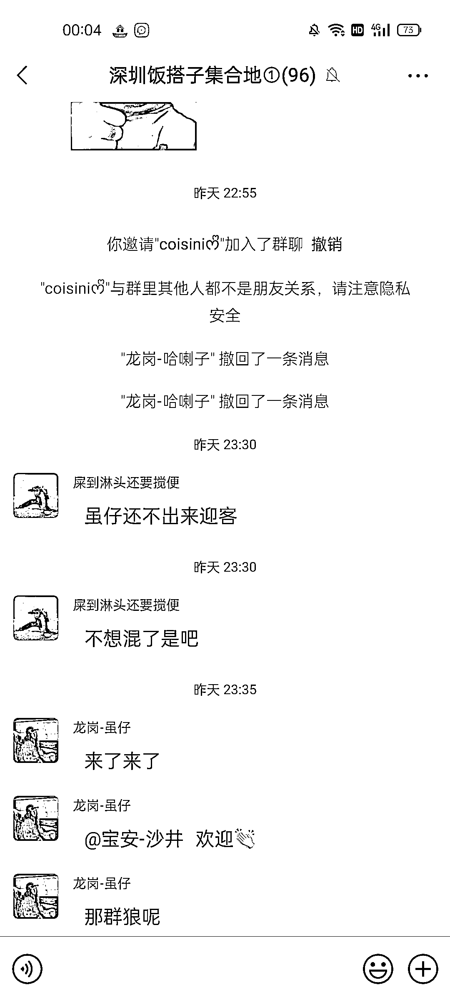
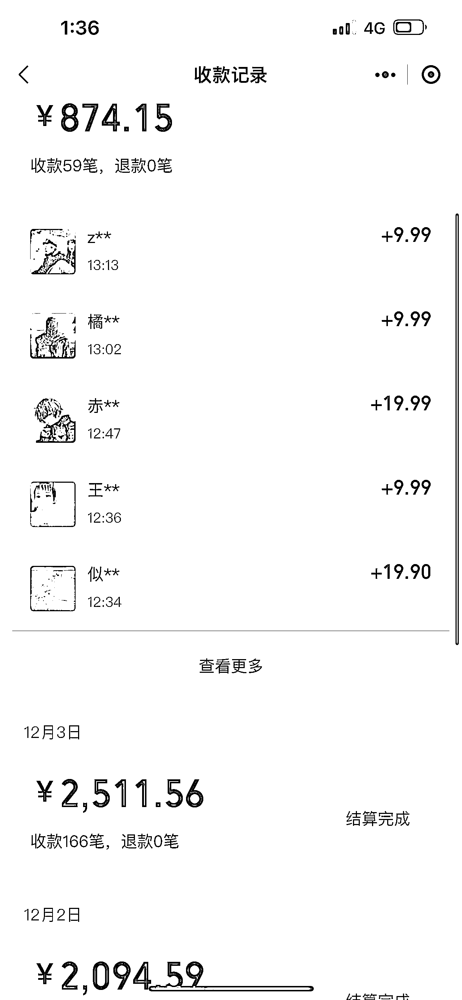

# 同城搭子群，一单 9.9-29.9，搭子经济，主打陪伴

> 原文：[`www.yuque.com/for_lazy/xkrm14/ca06namhm9fhkzrp`](https://www.yuque.com/for_lazy/xkrm14/ca06namhm9fhkzrp)

作者： 笑笑

日期：2023-12-05

点赞数：**81**

* * *

正文：

同城搭子群，一单 9.9-29.9，搭子经济，主打陪伴 在一线城市的人感触会很明显，尤其是背井离乡没什么朋友在身边，或者刚来到这座城市没有熟人
偌大的城市，想出去玩找了一圈列表里，发现没有什么能够叫的出来的人，或者想找个对象，却线下社恐看见喜欢的姑娘不敢要 wx 等等
由此产生了搭子这种词汇，例如干饭搭子，旅游搭子，学习搭子等等
大家差不多的年纪，在同一所城市，上班摸鱼能聊聊天，周末可以相约一起去海边吹吹风爬爬山唱唱歌🎤等等也是一个不错的选择
类似于这种的笔记，虽然点赞没多少，但是评论却高的吓人，小红薯，抖音，快手同理 基本受众人群 16-30 左右（目前测试基本都在这个区间）
建立一个同城交友群，女性免费，男的收 9.9-29.9 一个人，美名其曰防止广告或者防止一些下头男进入等等
全国各地都可以做同样的搭子社群，基本几个作品就能像图二一样差不多百来个人的群

* * *

评论区：

Yummi : 我做这个的，在快手做这个效果很好。

笑笑 : 抖音流量比快手更大，目前我们抖音快手小红书都有在做，建议你也可以试试抖音

业荣 : 引流到微信再拉进付费群吗？我看有一些是留公众号 做个程序直接 9.9 付费进群

笑笑 : 我们做的就是搭建的小程序，然后做的全国群，用户自助选择地区，然后直接进入就可以，分享的这个是我自己在深圳，自己私人号单独拉的

万能神 : 社群运营组织能力

i : [强]

路易生菜 : 哈喽圈友，能留个微信链接一下吗？我想做类似的社群想请教一下~

* * *

