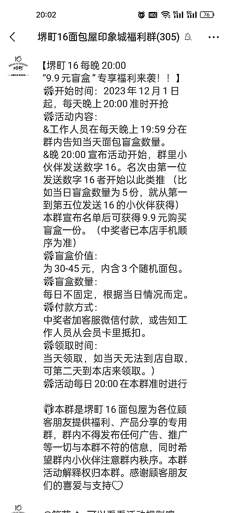

# 楼下包店的福袋和盲盒活动，免费抢红包引发裂变

> 原文：[`www.yuque.com/for_lazy/xkrm14/gcyv2ybkkggpies3`](https://www.yuque.com/for_lazy/xkrm14/gcyv2ybkkggpies3)

作者： 文少

日期：2023-12-04

点赞数：**58**

* * *

正文：

说一个我们公司楼下面包店的玩法，首先会把客户拉进群里，然后每天下午 17 点会搞一个福袋活动，谁抢到第 16 个红包，谁就会获得这个福袋，我刚开始也是被同事拉进去的，利用了免费抢红包得福袋让其它人做裂变。
然后等群里人差不多了就搞一个盲盒活动，9.9 元可以随机获得 30-45 元的面包，昨天晚上是第一次开始，群里一堆人报名（当然，可能有拖），不过可以借鉴一下

* * *

评论区：

倪大胖 : 前半句没看懂，16 个红包拉人啥意思

文少 : 意思就是红包 50 个，抢到第 16 个的才有福袋

文少 : 感谢老大！

能量菌 : 福袋是什么奖品呢？

文少 : 也是面包

阿里斯宝 : 能吃的面包吗

文少 : 能吃的宝哥🐶

* * *

公众号懒人找资源，懒人专属群分享