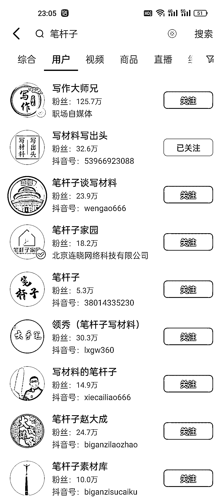

# 体制内写作：精准粉丝裂变，引流私域卖课的利器

> 原文：[`www.yuque.com/for_lazy/xkrm14/aiermhhlcrmcf3l5`](https://www.yuque.com/for_lazy/xkrm14/aiermhhlcrmcf3l5)

作者： 熊猫

日期：2023-12-05

点赞数：**63**

* * *

正文：

体制内的人写体制内容，常见的公文写作、领导发言稿、活动策划……垂直的去写，这类作品的粉丝及其精准，并且容易裂变老顾客推荐新顾客，既可以写出爆品也能够引流私域卖课培训等等

* * *

评论区：

能量菌 : 在不确定的当下，体制相关内容也越来越火了

米斯特 LIu : 悠着点搞，小心号哪天就没了😂

* * *

公众号懒人找资源，懒人专属群分享