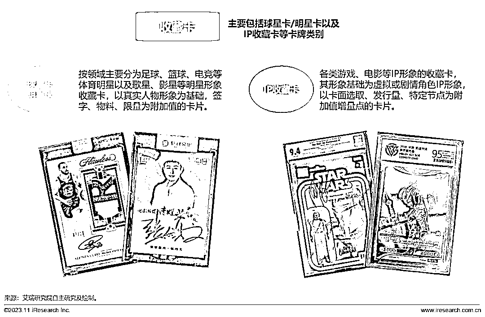
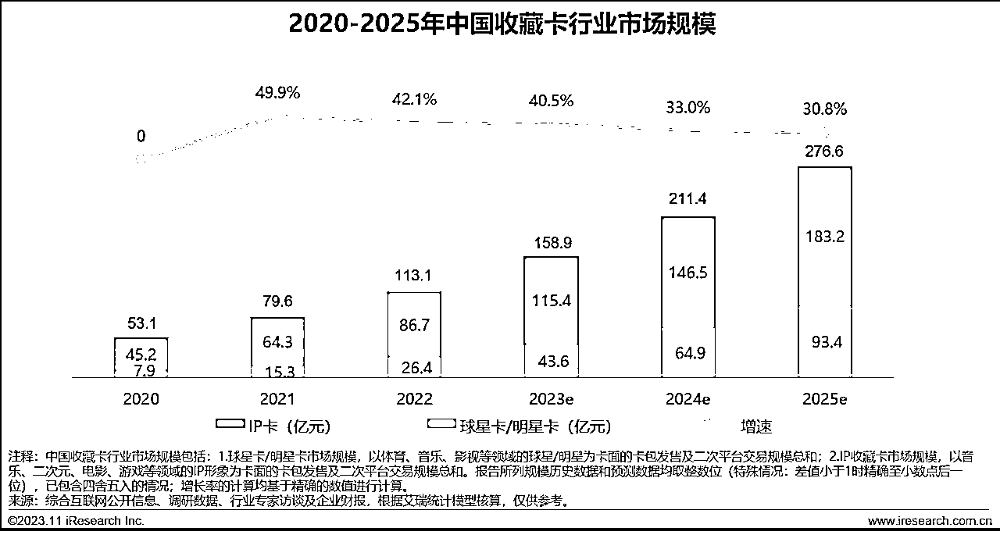
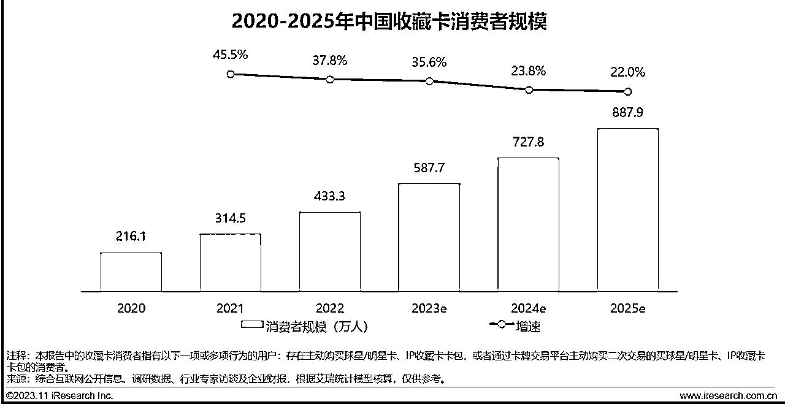
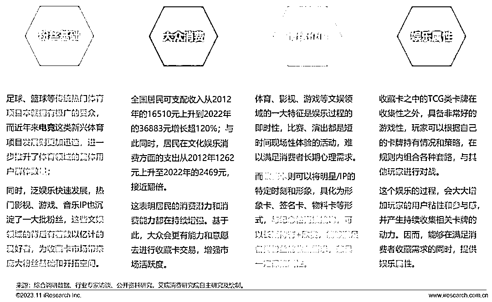
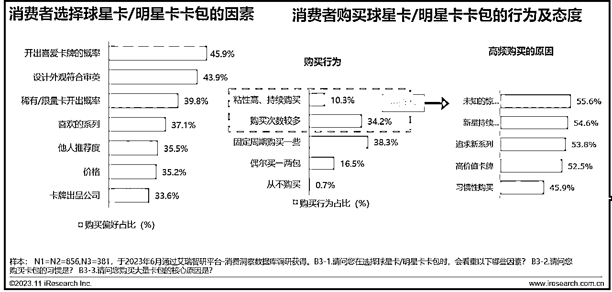

# 中国收藏卡市场：规模预计将达 276.6 亿元，商机潜力巨大

> 原文：[`www.yuque.com/for_lazy/xkrm14/vr1bgaz3evkdglpo`](https://www.yuque.com/for_lazy/xkrm14/vr1bgaz3evkdglpo)

作者： 林林 AIGC 写作

日期：2023-12-04

点赞数：**46**

* * *

正文：

11 月 29 日，艾瑞咨询发布了《2023 年中国收藏卡市场研究报告》，全面展示了当前国内收藏卡市场的现状，并进行了分析整理，梳理出未来收藏卡市场的发展趋势。以下是报告的关键点和潜在的商业机会：
关键点摘要 1\. 市场规模与增长：2022 年，中国收藏卡行业市场规模超过 100 亿元，预计到 2025 年将达到 276.6 亿元。 2.
消费者规模与参与度：2022 年，中国收藏卡消费者规模达 433.3 万人，同比增长 37.8%。 3.
市场产业链与发展驱动因素：收藏卡市场的参与者越来越多，每个群体也在逐渐扩大，市场对特定卡牌的需求持续增加。 潜在商业机会 1.
专业交易平台的发展：随着交易量的增大，专业交易平台在收藏卡的分类、描述、交易机制和保障机制方面不断升级，方便消费者准确下单。 2.
O2O 助推收藏卡进一步发展：线下活动的恢复将进一步提升收藏卡市场声量，成为新的趋势。 3.
业态逐渐成熟，覆盖领域拓宽：随着收藏卡覆盖领域日渐拓宽，IP 代理成为收藏卡下一阶段发展的关键领域。
这些洞察对于希望在中国市场推广收藏卡相关产品和服务的企业来说非常有价值。

* * *

评论区：

万能神 : ip 变现方式之一

* * *

