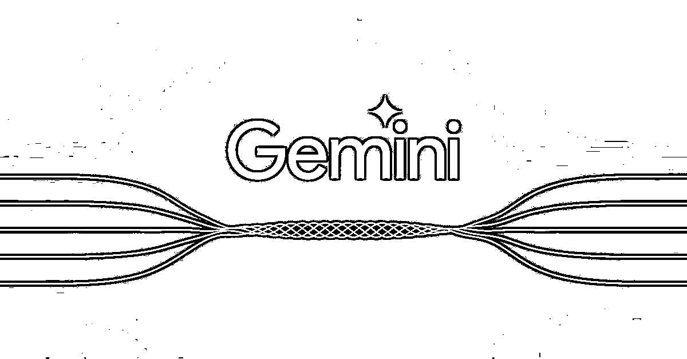
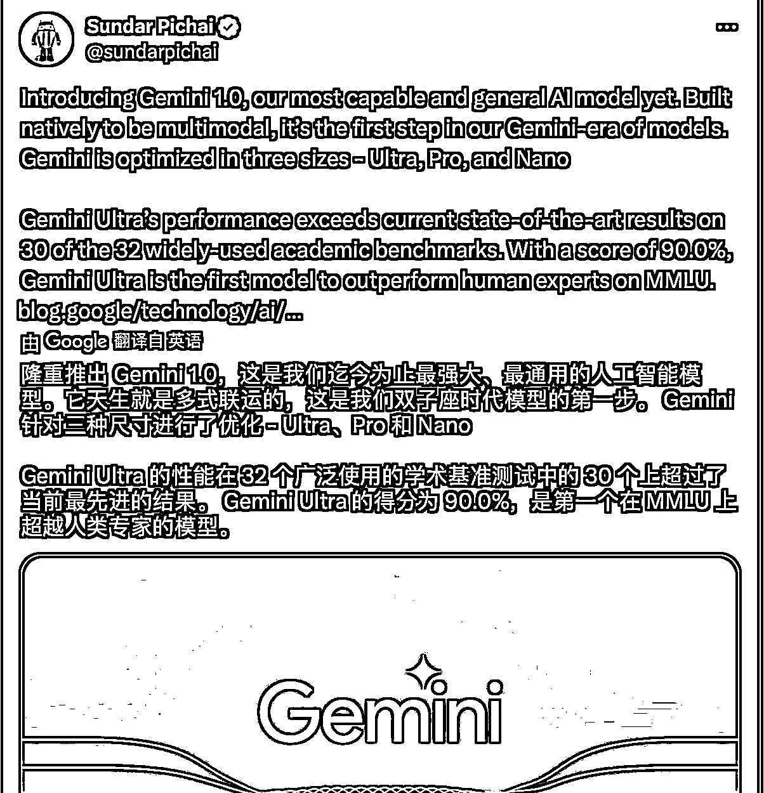

# 谷歌发布 Gemini Ultra，在 32 个基准测试中超越 ChatGPT-4

> 原文：[`www.yuque.com/for_lazy/xkrm14/ixgvoby2m3aqmal0`](https://www.yuque.com/for_lazy/xkrm14/ixgvoby2m3aqmal0)

作者： 11

日期：2023-12-06

点赞数：**58**

* * *

正文：

吊打 GPT-4， 谷歌宣布推出其认为规模最大、功能最强大的人工智能模型 Gemini，Gemini Ultra 的性能在 32 个基准测试中 30 个上超过了 GPT4

* * *

评论区：

* * *

公众号懒人找资源，懒人专属群分享