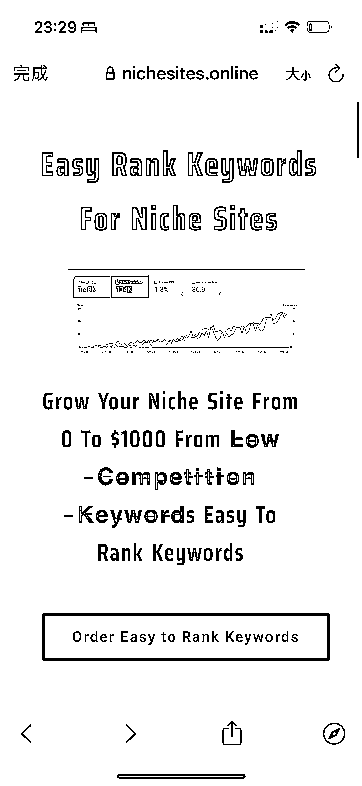
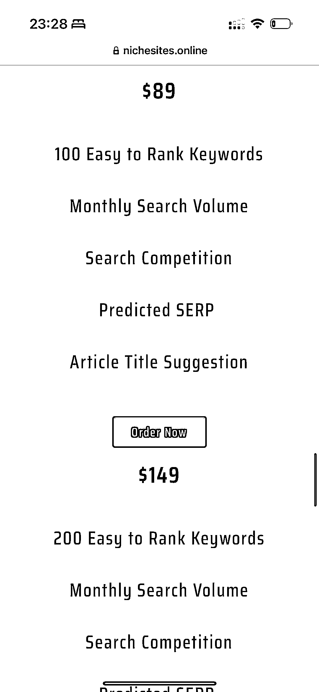

# 创建资源的方法：Easy Rank Keywords For Niche Sites

> 原文：[`www.yuque.com/for_lazy/xkrm14/iu3hwghbw7nl1tn1`](https://www.yuque.com/for_lazy/xkrm14/iu3hwghbw7nl1tn1)

作者： 易博

日期：2023-12-04

点赞数：**48**

* * *

正文：

没有资源，就收集资料创建资源。一个细分领域的 Easy Rank Keywords For Niche
Sites，收集超过 4000 个词，通过 x 做广告卖，做 niche 的 niche，定价$150，200 个词

* * *

评论区：

* * *

