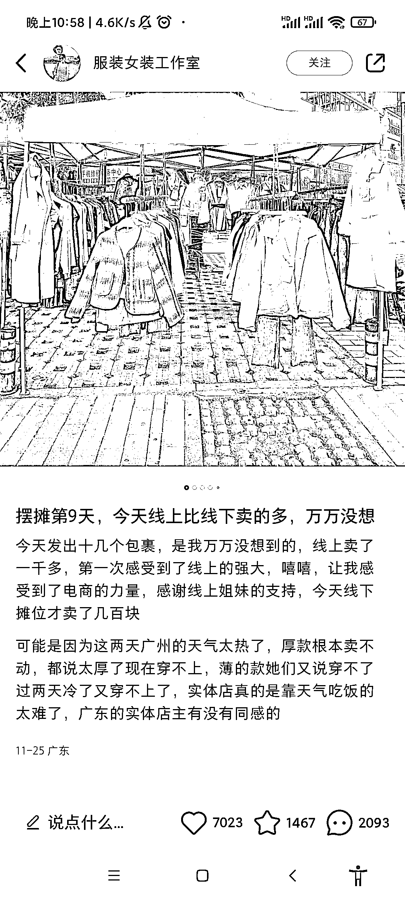
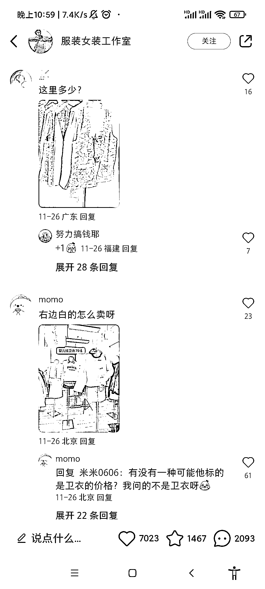
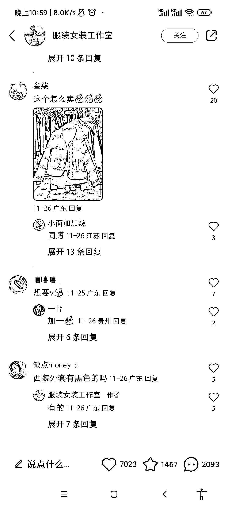

# 线下摆摊卖衣服，真实服装照片吸引精准粉丝，客户主动索要微信

> 原文：[`www.yuque.com/for_lazy/xkrm14/oqyc2tu3tah7rdbg`](https://www.yuque.com/for_lazy/xkrm14/oqyc2tu3tah7rdbg)

作者： 大海小溪

日期：2023-12-04

点赞数：**46**

* * *

正文：

线下摆摊卖衣服，拍一些真实的服装照片，吸引了不少精准想买衣服的粉丝，客户主动要微信

* * *

评论区：

曜文 : 这个方式 2 年前在小红书流量就非常大 现在也如此

大海小溪 : 第一次中标，感谢亦仁老板🙏[愉快]

大海小溪 : 原来如此[强]

* * *

