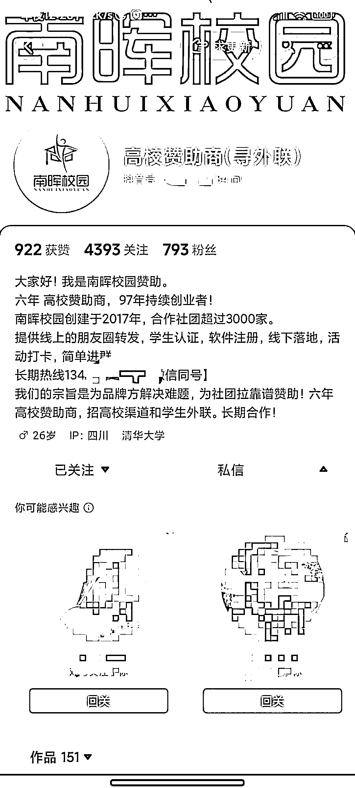
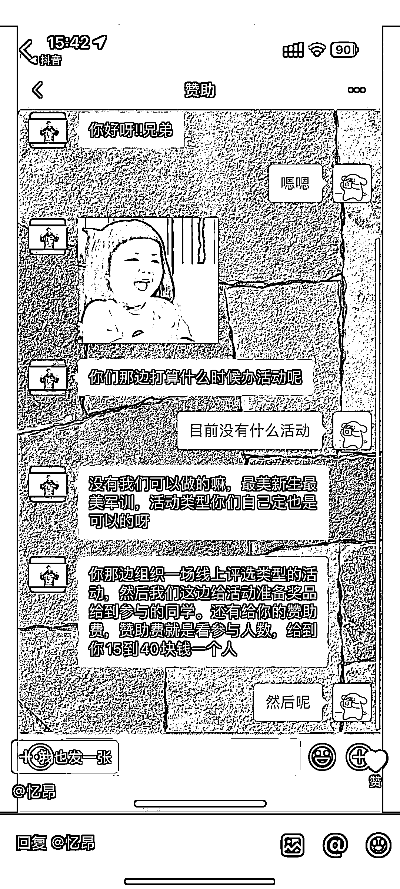
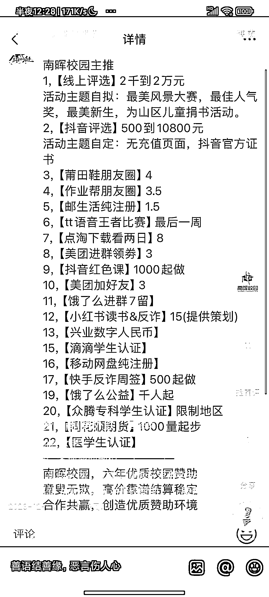

# 大学生赞助投票拉新，利润可观，但存在封号限流风险

> 原文：[`www.yuque.com/for_lazy/xkrm14/zmhbcle0eqr2atzw`](https://www.yuque.com/for_lazy/xkrm14/zmhbcle0eqr2atzw)

作者： 初心～大林

日期：2023-12-05

点赞数：**45**

* * *

正文：

大学生赞助投票拉新，利润很可观，于是抖音搜索了下相关内容。
内容：利用私信、群聊、短视频等各网络渠道获客，对接学校外联、学生会、表白墙等有校园影响力的 kol，提供赞助举行活动，活动投票开通付费投票入口（或图三的拉新、认证等等），以此变现。
分析：网评一般，账号数据一般，没有很好的头部账号，基本都是个人号，估计会有封号限流风险。利润可观，可做参考，举一反三，不建议上手做。

* * *

评论区：

初心～大林 : 感谢亦仁老大

* * *

