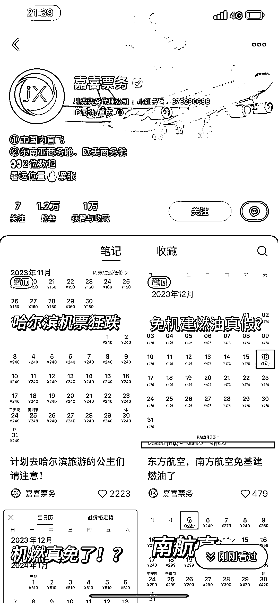
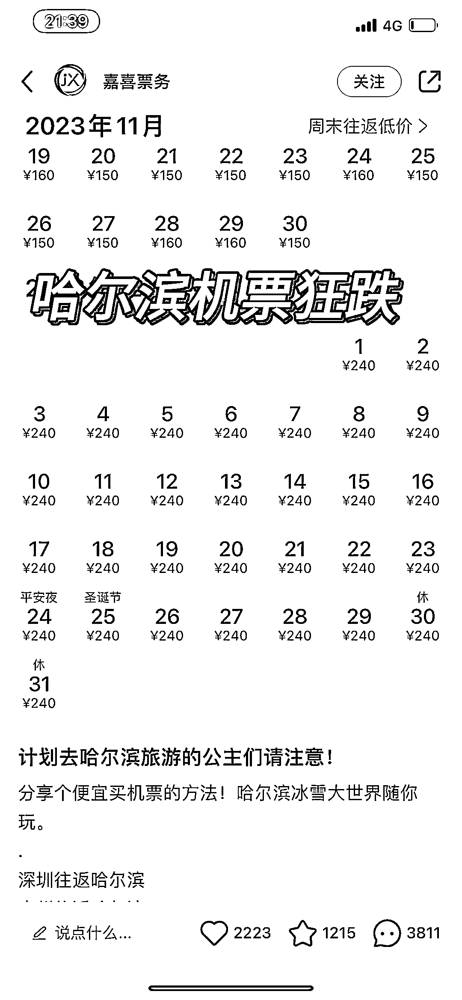
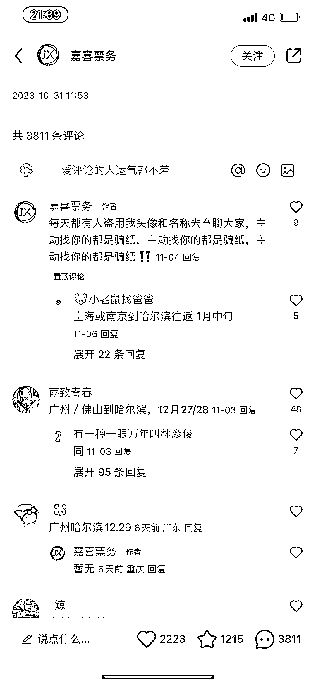
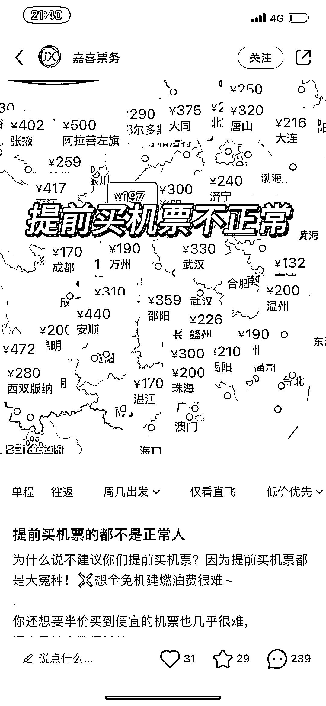

# 旅游热起来了！购买机票需求旺盛，这个票务账号评论-赞藏比最高！

> 原文：[`www.yuque.com/for_lazy/xkrm14/itc1rsmhy7yhhu2o`](https://www.yuque.com/for_lazy/xkrm14/itc1rsmhy7yhhu2o)

作者： 芝慧

日期：2023-12-06

点赞数：**38**

* * *

正文：

旅游热起来了！相关需求比如购买机票的需求就非常旺盛！下图这个非常垂直的票务账号是我见过的评论/赞藏比最高的！！！抓住低价便宜的特点来引流营销。 延伸：
1⃣️图上账号以国内市场为主！那完全可以专门做一个国际的或者专门飞某些热门境外国家的票务号，引流私域卖票🎫；
2⃣️在 1⃣️的基础上和境外旅行社合作，卖客资互利互惠； 3⃣️作为旅行矩阵账号之一来运营引流变现！ （可以着重看下截图里的评论数量）

* * *

评论区：

芝慧 : 图 5⃣️点赞 3 个，评论 13 个，且询问客户需求（时间➕地点）明确！完全可以和旅行社合作，精准营销！

远征 : 会有同行投诉非认证号发的作品，我发布一次就永久封禁了。举报我那个人怀疑还认识😂

芝慧 : 🤯啊 ？那还是得企业号！

远征 : 我听同行说做这个要在小红书投资 2 万做认证号，做认证号肯定要有资质的，同行还介绍还要有 IATA 会员，这个会员也要 20 多万押金。
其他专业度就是熟悉航线了，目前我了解到这里。

芝慧 : 企业号确实要交钱的，但是这类型的我没注意过，二奢箱包我们之前是 600 还是 1000 一年，要是二万也太贵了，还有会员门槛也太高了吧[捂脸]

芝慧 : 谢谢远征大佬！我去搜搜看，了解了解😂

远征 : 这几天我也有点神经 看的项目都挺好 门槛都高。 国际机票，利润确实高 一单一千到几千不等。发了一个笔记就被永久封禁。
假肢，这个也需要医疗资质[捂脸]，没资质肯定做不长。这种小红书、淘宝、拼多多、反正是正规平台都不行。 对还有东北的林蛙，这个玩意居然也要资质才能售卖[捂脸]

芝慧 : 我刚小红书又看了下，确实大部分票务的小红书账号都是企业号，偶尔也有个人账号，但是数据确实要差一些！大部分是 IATA 会员🥹🥹

* * *

公众号懒人找资源，懒人专属群分享