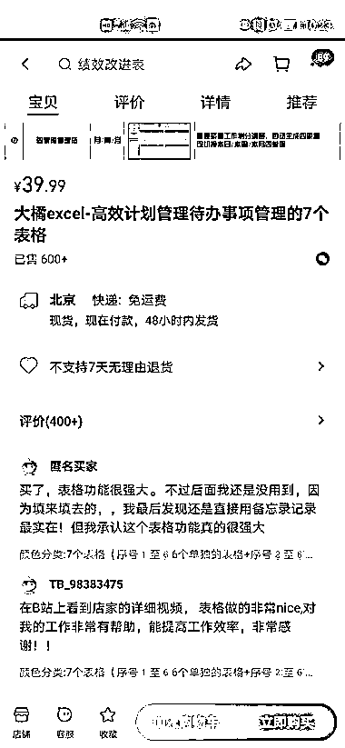
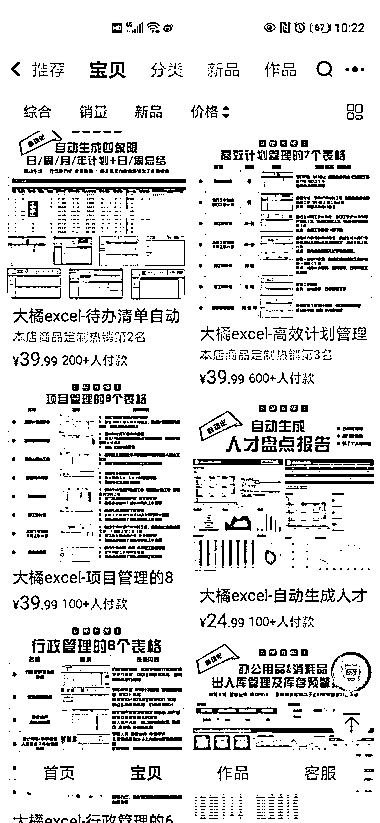

# 表格生成计划表，淘宝销量差价大，垂直引流效果显著

> 原文：[`www.yuque.com/for_lazy/xkrm14/gs2ix7pkxpibshty`](https://www.yuque.com/for_lazy/xkrm14/gs2ix7pkxpibshty)

作者： 徐铭悦

日期：2023-12-08

点赞数：**81**

* * *

正文：

表格生成各种计划表，开始我以为是引到微信，引流到淘宝，随便点一个销量都很好，很垂直，只是在淘宝上搜了一下，差价就很大了

* * *

评论区：

能量菌 : 这个表格是有公式嘛

徐铭悦 : 是的，会的很简单

* * *

