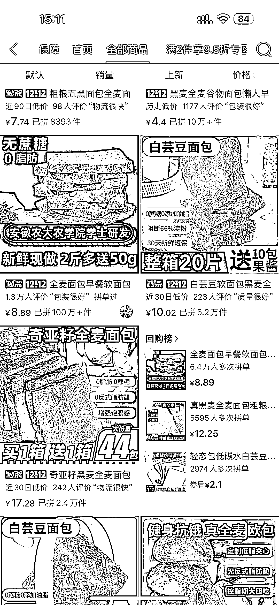

# 拼夕夕面包店：亮点在于高校名号和健康配料

> 原文：[`www.yuque.com/for_lazy/xkrm14/ig3zyr4twrhx2rm6`](https://www.yuque.com/for_lazy/xkrm14/ig3zyr4twrhx2rm6)

作者： Ann

日期：2023-12-04

点赞数：**52**

* * *

正文：

这个拼夕夕面包店，估计是安农大本科毕业生开的，发货地/生产地就在农大这边，也在我附近。三年店铺，这一个全麦面包的产品居然卖了 100 万+单，我在拼夕夕只看过 10 万+的，然后整个店铺还有很多其它卖了 10 万+的产品，不是刷的，因为评价都是 10 万+，而且我也经常买😂。
我觉得最大的亮点就在于他把这个高校的名号用的恰当好处，对很多普通老百姓来说还是很有吸引力的，然后配料表干净（符合当前人们对健康的需求），再者就是针对减肥人群（全麦面包口感挺差的，但是这个口感很好），另外客单价不高，回购的人非常多。
这个主产品，其实配料非常简单，但是标上农学院学士研发，感觉高大上了不少。我本科也是学食品的，当时老师说面包蛋糕行业暴利，叫我们可以去干哈哈。有开厂的可以学习一下它，个人感觉挺厉害的。

* * *

评论区：

美妙人生 : 这个产品在其他渠道上投流和种草的费用成本挺高的，口味不佳复购率一般。

Ann : 不同厂家的全麦面包口感差别非常大的，这家的回头客绝对多的很，我第一次吃的感觉，是全麦面包居然可以这么好吃，而且无添加剂，价格还便宜。

Ann : 不知道你说的产品是不是这家的这个面包哈，我吃过很多全麦面包，大多口感都不好，要不就是假全麦面包

美妙人生 : 打着农业大学科研背景应该是同一家，我是 19 年就关注到很猛的推广知乎微博各种自媒体渠道有看到，战略部还去做了调研商业模式和财务数据看要不要投资进去，这个品牌当时想走融资上市路线，做了很多数据。当时买过就真不好吃，后面有没有改良不清楚。

Ann : 奥奥，居然还想上市，真厉害，有可能这些年做了点改进吧，之前海克斯科技不是闹的挺火嘛，可能跟这个无添加剂的噱头也有关系，增加了后面的销量。我吃过很多巨难吃的全麦面包，这个真的觉得可以哎
准备回购一箱😂当然也跟我个人口感有关。

美妙人生 : 这家就是不普通的个体户产品，是正规团队企业做这个业务，虽然企业不大

小毛驴 : 吃过田园主义日加能全麦面包吗？跟他们比口感怎么样

* * *

