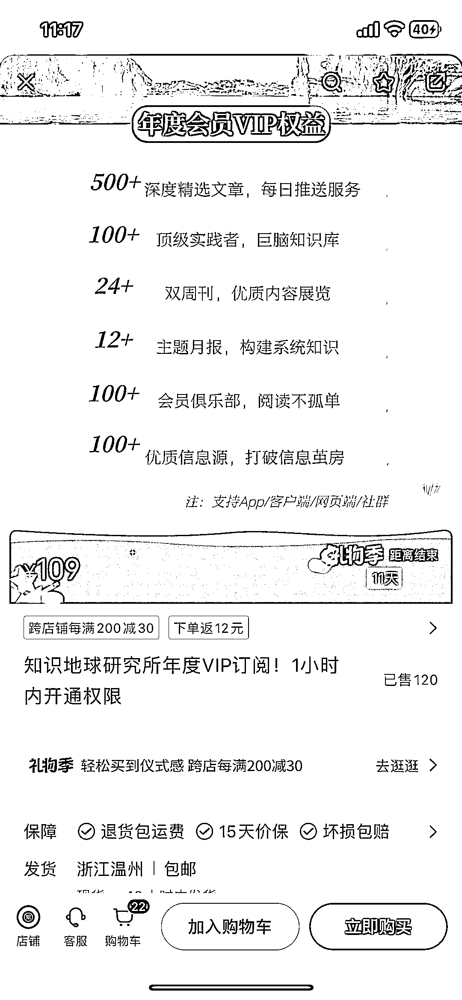
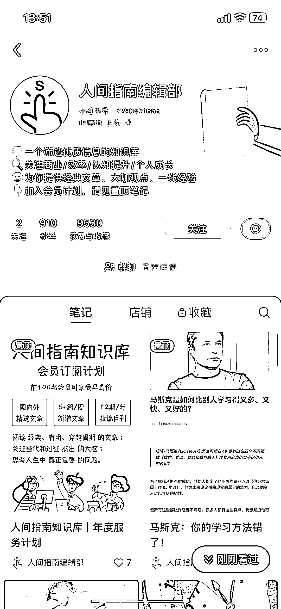
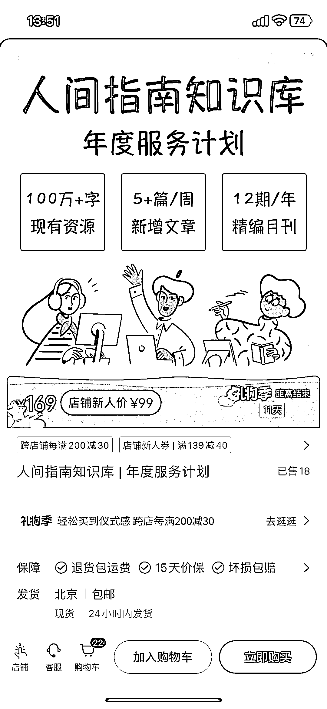

# 小红书推出优秀文章合集专栏，提供 notion 库访问资格年付服务

> 原文：[`www.yuque.com/for_lazy/xkrm14/he59ocvztk7c309g`](https://www.yuque.com/for_lazy/xkrm14/he59ocvztk7c309g)

作者： 零喋喋零🌙

日期：2023-12-14

点赞数：**86**

* * *

正文：

小红书直接卖优秀文章合集专栏，本质上是筛选好的信息源，然后抓取到 notion 中，卖 notion 库的访问资格，年付。
还可以做各种细分赛道的，比如文学和艺术品类的，一下刷走了没截到图。

* * *

评论区：

零喋喋零🌙 : 还有参考答案

零喋喋零🌙 : 这些都是泛个人成长类的。

张小悦 : 想问一下，这个涉及到版权问题吗？

零喋喋零🌙 : 他们大部分都是搬运的优质的国外公开的博客 或者 论文
访谈等公开在社交媒体上的信息，他们说自己卖的是筛选的服务。那种版权特别明显的书籍或者体系化课程他们不会分享的。

张小悦 : 哦哦，谢谢！

* * *

公众号懒人找资源，懒人专属群分享