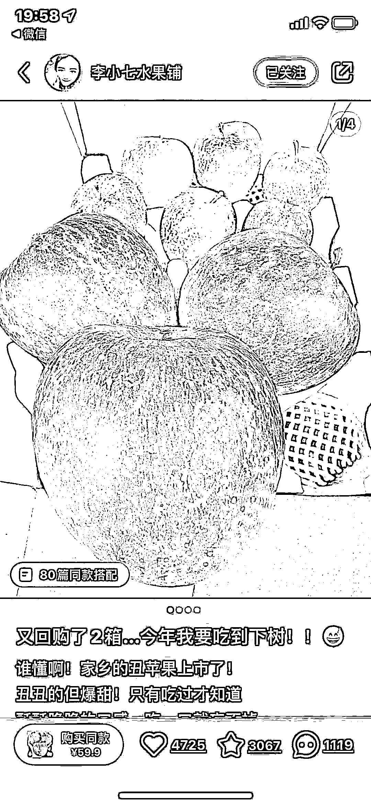
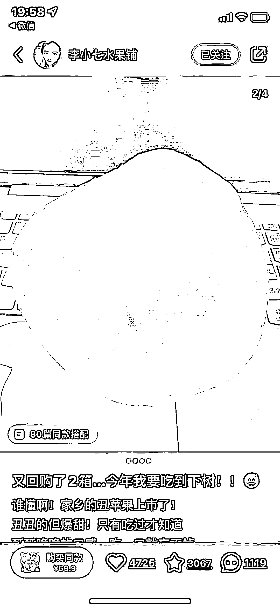

# 小红书卖苹果突破 300 万销量，三农类-零食类揭秘爆款内容模版

> 原文：[`www.yuque.com/for_lazy/xkrm14/myidvcs172vnonvv`](https://www.yuque.com/for_lazy/xkrm14/myidvcs172vnonvv)

作者： 陶金金（阎老板）

日期：2023-12-14

点赞数：**86**

* * *

正文：

小红书卖苹果居然卖了 300 多万！简直是三农类/零食类对标的神号，直接拆解其内容模版。以爆制爆啊家人们！
水果类最常见的爆款内容就是啃一口。或者堆起来拍。这个作者的标题也非常第三视角，很懂运营啊！
以爆制爆：“爆款内容选题＋爆款内容形式＋爆款产品”，笔记连怼，很快能见到效果！ 就是比较粗暴的流水化作业：
任何产品找到自己类目下爆起来的爆文，或者自己账号爆起来的爆文，反复怼
（即使是怼，是原创，也要掐头去尾重拍顺序更新背景音乐等等，为了避免被系统检测搬运或者抄袭） 如果多个矩阵账号，成功率会更大，成为爆款速度一定更快

* * *

评论区：

张剑波 : 这个品去年这个时间也在抖音火了一段时间😂

* * *

