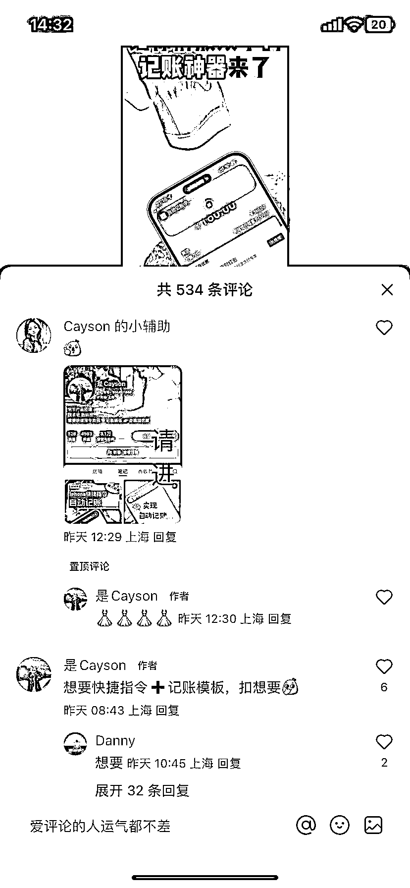
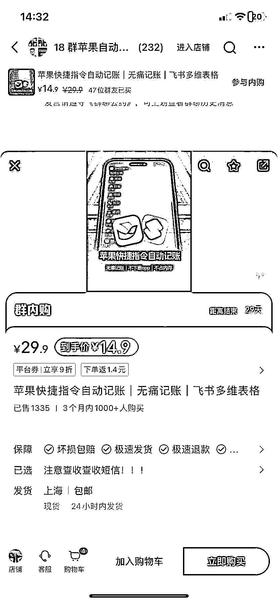

# 小红书新变现方式：小众虚拟产品引流群购，无风险高收益

> 原文：[`www.yuque.com/for_lazy/xkrm14/shilg99ianr4r282`](https://www.yuque.com/for_lazy/xkrm14/shilg99ianr4r282)

作者： Believer

日期：2023-12-13

点赞数：**75**

* * *

正文：

小红书小众虚拟产品 小红书卖虚拟资料赛道太卷了，不如换个赛道 这个博主用苹果的快捷指令做了一个自动记账神器 变现近 2w 不断拍使用视频来引流
更厉害的是他还上架到小红书店铺，然后不挂车来放大流量 然后在评论区用图片引导进群聊，配合小红书群购功能，感兴趣的用户一进去就会得到提示
拆解一下这个丝滑的引流变现流程： 1、笔记不挂车获取最大流量 2、置顶图片评论让感兴趣的用户一目了然 3、引导进群筛选精准用户
4、群购功能直接变现，无风险、无需接待 感觉会是未来小红书一种新的站内变现手段

* * *

评论区：

拖拉机不拖拉 : 虚拟商品可以开店吗

骷比絨 : 小红书现在虚拟资料赛道有多卷了？

胡丫丫 : 这种店铺需要开通什么资质啊，是教育培训吗

勿拧巴 : 可以直接问小红书客服的

* * *

