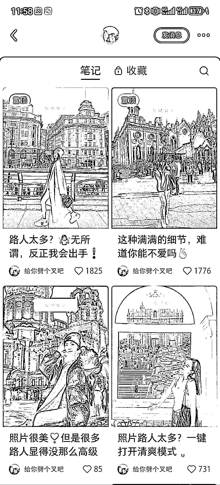

# 简单易学的小红书照片去除教程，快速实现去除多余人物

> 原文：[`www.yuque.com/for_lazy/xkrm14/cpv2c5kp4oa5vk46`](https://www.yuque.com/for_lazy/xkrm14/cpv2c5kp4oa5vk46)

作者： 陈龙

日期：2023-12-13

点赞数：**77**

* * *

正文：

刷小红书的时候刷到一个有趣的小项目，去除掉照片里面多余的人 这一点实现起来其实很容易的，用 psai 就行，新手玩家上手应该也就半个小时左右吧
教程可以去 b 站学一下，不难，各类安装包在 b 站也有，或者淘宝拼多多买一下，不贵，10 块 20 块差不多
流量是真的很猛，前期起号可以对标，这个微博主先免费，后续付费还可以引流，账号起来之后还可以带货 做其他项目的是不是也可以延伸一下，比如说照片 ai 画
可以用 mj 或者 sd 模型来跑

* * *

评论区：

米多利 : 这个用 ps 的那个在线工具就可以，adobe firefly，几分钟一个，只不过需要梯子

陈龙 : 谢谢分享，那这样的话门槛就会变得更低了

米多利 : 是的

晨冬 : 小米手机自带去除功能，果然是信息差

林林 AIGC 写作 : 哈哈哈哈哈 你中标的上面的那条风向标就是 直接规模化了 [`t.zsxq.com/15bnSZDXB`](https://t.zsxq.com/15bnSZDXB) 

陈龙 : 谢谢亦仁大大

🌈程程爱数码 : 原来是 ps 跟 ai，我还以为 psai 是什么新出的软件

* * *

