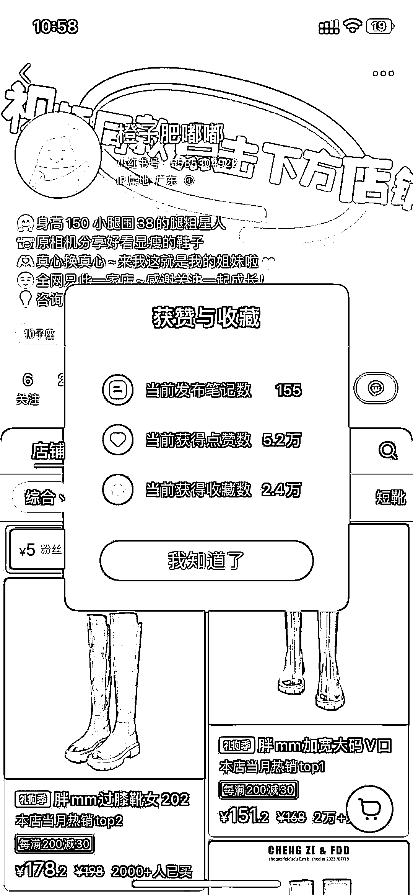
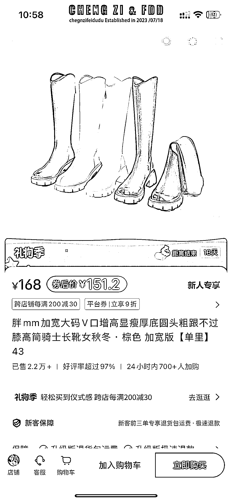

# 小红书店铺销量破 3 万，这款鞋子成为热卖

> 原文：[`www.yuque.com/for_lazy/xkrm14/huismhnyf0iqvumz`](https://www.yuque.com/for_lazy/xkrm14/huismhnyf0iqvumz)

作者： Luna

日期：2023-12-12

点赞数：**64**

* * *

正文：

小红书这家店发了 155 条笔记，只是靠笔记出单，总销量是 3 万，这款鞋子就占到了 2.2 万，卖点是为较矮和腿粗腿胖的姐妹穿上后显高和显得没那么粗，好评率高达 4.9 分（满分 5 分），24 小时内 700 人加购，1688 上来货 103 元，卖 163

* * *

评论区：

* * *

公众号懒人找资源，懒人专属群分享