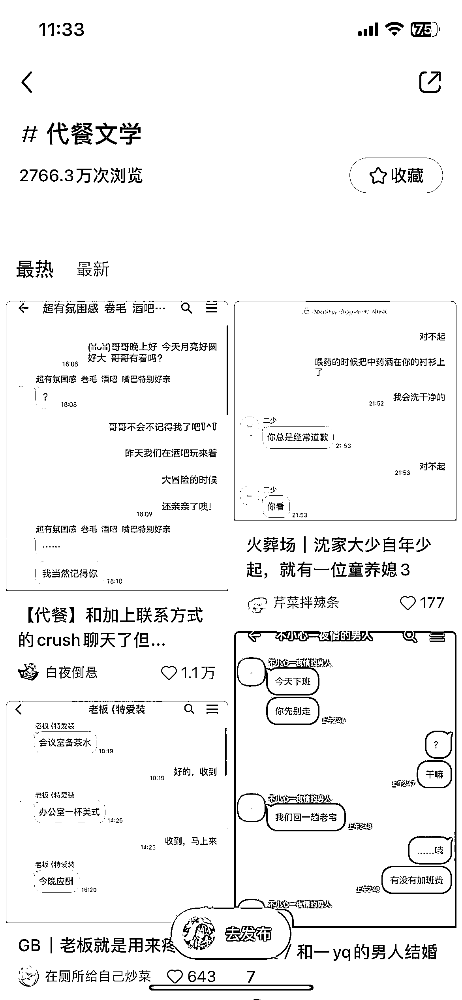
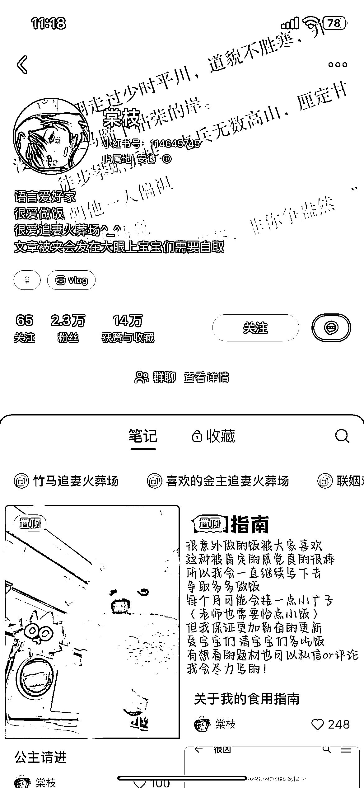
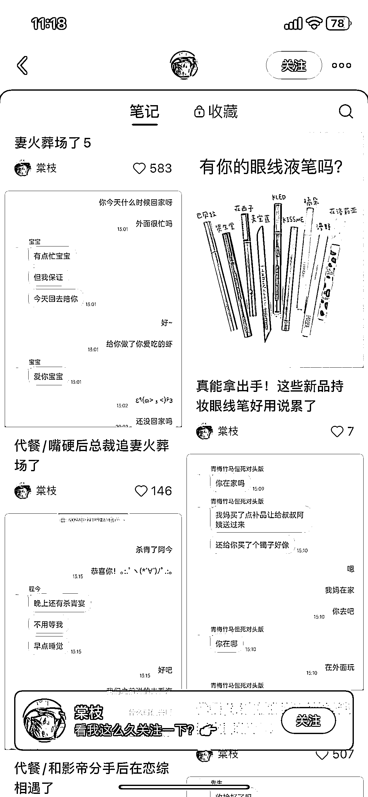
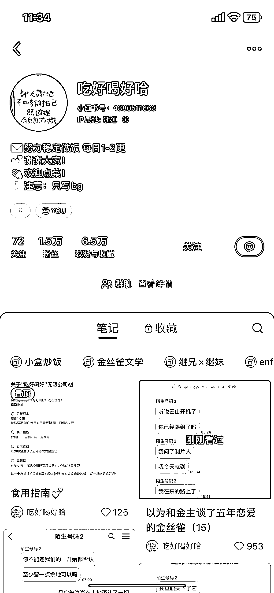
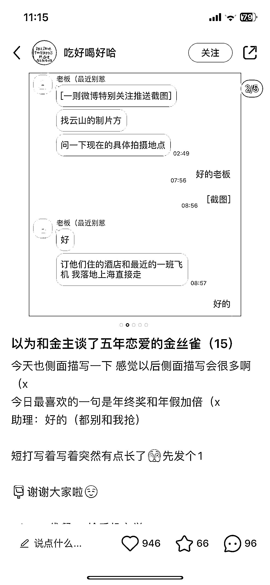

# 小红书新兴营销方式：代餐文学和捡手机文学

> 原文：[`www.yuque.com/for_lazy/xkrm14/quehk6mdble4wuyp`](https://www.yuque.com/for_lazy/xkrm14/quehk6mdble4wuyp)

作者： 冷静

日期：2023-12-14

点赞数：**55**

* * *

正文：

小红书最近出现一种“代餐文学”“捡手机文学”，
基本上不用什么成本，就是用角色聊天的形式营造一篇情景短剧，很击中现在用户没什么耐心阅读长文章的心理，并且这种关于“爱情”的内容很容易引发用户的讨论。每个号的数据都很不错，几十条内容涨粉八千多，点赞有几万。
可以通过接好物分享广告、小说推文广告、卖号等方式变现。

* * *

评论区：

马时珍 : 😂😂😂

零喋喋零🌙 : 啊这是捡手机的文学体裁啊 同人小说圈很流行

三番 : 我找到一个类似的，答案之书，也是偏向于女性情感和女性成长的方向，玩法都是一样的。

加麻 : 什么是同人

零喋喋零🌙 : 某作品或者人物的衍生作品

杨野 : 不是很能看懂，就是聊天记录曝光是吧，这种确实很有吸引力，满足观众的窥私欲，但是为啥叫做代餐文学捡手机文学[疑问]？

冷静 : 都是同人文化新的一种阅读方式，简单讲就是现有的无法满足，观众自己二创其衍生作品

* * *

公众号懒人找资源，懒人专属群分享