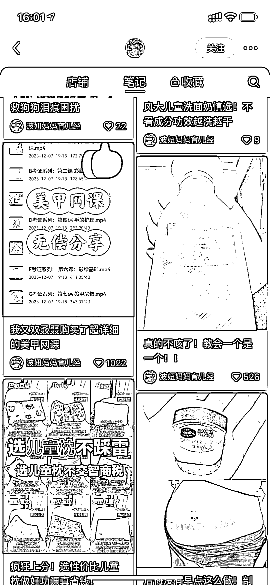
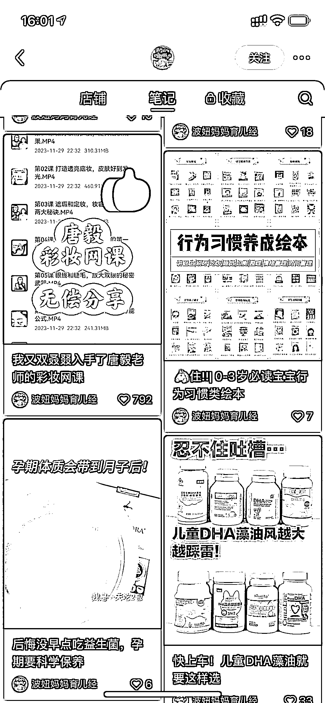
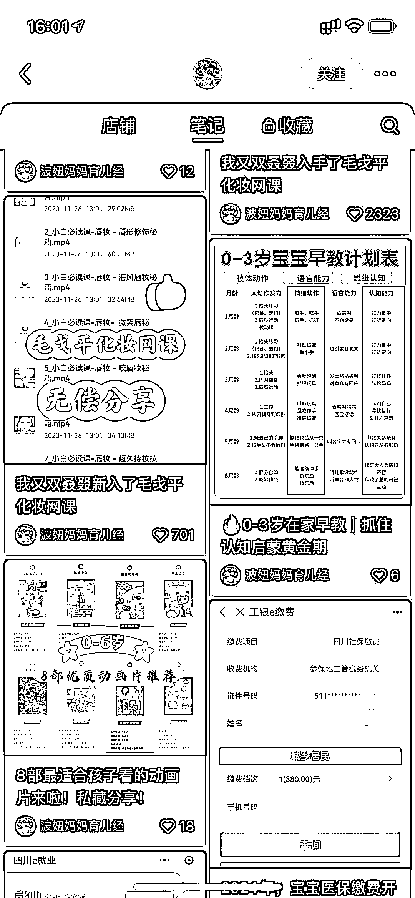

# 小红书涨粉新方法：无偿分享网课

> 原文：[`www.yuque.com/for_lazy/xkrm14/aqmt8st954dmyi3u`](https://www.yuque.com/for_lazy/xkrm14/aqmt8st954dmyi3u)

作者： annabelle.

日期：2023-12-11

点赞数：**45**

* * *

正文：

看到一种小红书的涨粉方式：无偿分享网课。 数据好，人群也很精准~

* * *

评论区：

一时 : 你怎么确认就涨粉？或者他们之下收藏一下呢😂

佐敦道 : 这个牛逼哈哈，天亮就安排公司人做号

南屿有鱼 : 这种没有版权风险吗

🇨🇳许仙 : 牛哇

海艳 : 要求对方➕关注再给分享资料呗

* * *

