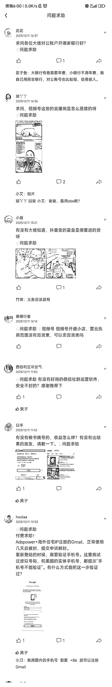
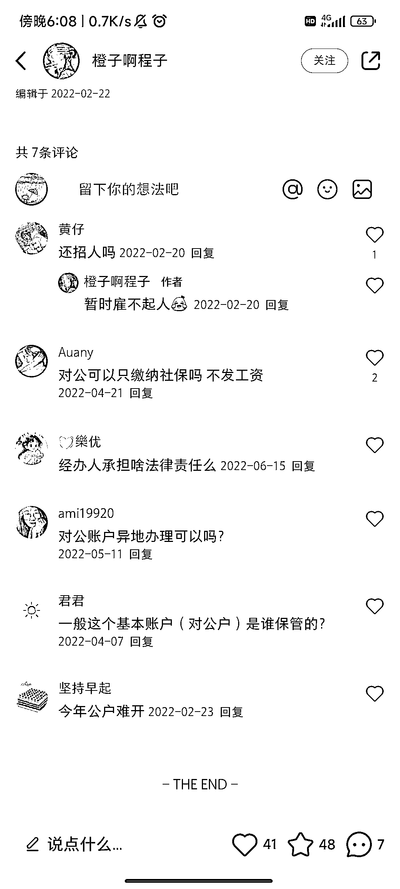

# 寻找高价值用户的风向标：关注他们的问题求助

> 原文：[`www.yuque.com/for_lazy/xkrm14/mhmsexz9yahzy2cn`](https://www.yuque.com/for_lazy/xkrm14/mhmsexz9yahzy2cn)

作者： 磊爷

日期：2023-12-11

点赞数：**134**

* * *

正文：

在星球里搜索关键字「求」，或者看「问题求助」栏目，看看生财的高价值用户都遇到了什么问题。
这些问题都是精准需求，为这些愿意付费的用户解决问题，都是机会，特别是多次出现的问题。
也可以用这些关键字去各个平台搜索，关键字拆分，加上 a-z，发现风向标的机会大大增加。

* * *

评论区：

徐 Ken : 很好的切入点[强]

一栗米范 : 思路很好啊

文少 : 优秀啊

热爱 : 牛[玫瑰][玫瑰]

Kelom# : 我怎么没想到，牛 逆向思维

佐敦道 : 牛逼

* * *

