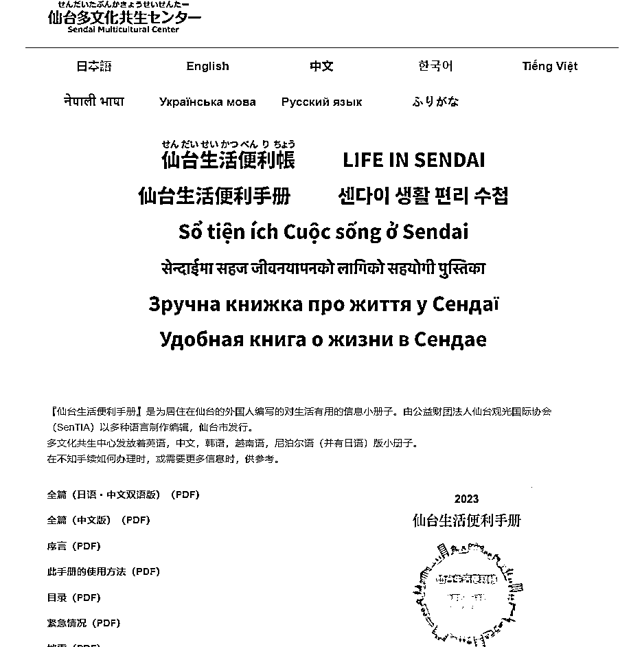

# 城市生活手册：为你提供全方位指南

> 原文：[`www.yuque.com/for_lazy/xkrm14/dgyzs5mxm5ekamao`](https://www.yuque.com/for_lazy/xkrm14/dgyzs5mxm5ekamao)

作者： 嘟

日期：2023-12-13

点赞数：**105**

* * *

正文：

每个城市都可以有这么一个生活手册。
国内的也是，比如大学生在某个城市毕业后，或者出到某个地区工作，从租房到工作、出行，如果有一个成体系的小册子，我是愿意购买的。 [仙台生活方便手册](https://int.sentia-sendai.jp/foreigner/c/) 

* * *

评论区：

Kelom# : 哇 新思路

林林 AIGC 写作 : 这是公益财团法人仙台观光国际协会（SenTIA）制作编辑的，不得不说日本的 NPO 真的 hin 利他

林林 AIGC 写作 : 另外如果要做国内的可以做飞书会更方便一些，比如公交线路有变化啥的也能实时更新。

茜 : 买的人多了，还能接一些商家广告

梁凉凉 : 和（本地宝）公众号是一个逻辑

刘皇叔 : 感觉还是有区别的，这种内容可以不断积累，越积累越牛逼，而本地宝那种都是碎片式的

徐 Ken : 1、基础版资料免费，高阶版资料付费。 2、卖广告位。 3......

* * *

