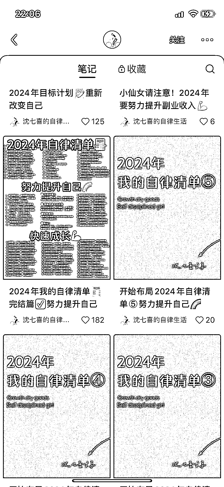

# 二千零二十四、话题账号迅速获得粉丝

> 原文：[`www.yuque.com/for_lazy/xkrm14/zgrogkze3oapc50o`](https://www.yuque.com/for_lazy/xkrm14/zgrogkze3oapc50o)

作者： 熊孩子不差！

日期：2023-12-14

点赞数：**98**

* * *

正文：

建一个账号专门发 2024 相关的话题，账号做了不到 1 个月，1600+粉丝，发帖 42 篇，其中单篇最高赞 2000+。
内容来源：搜索自律、女性成长相关的话题，把这些话题下面的内容组合一下，贴上 2024 的标签。
内容制作成本：固定模版，每次换里面的字就行，10 分钟之内搞定一篇图文。 后期变现：可以接自律、学习周边的广告或者引流到私域卖自律打卡产品。

* * *

评论区：

Jing : Growth dry goods…这干货直译有点没文化了，哈哈哈哈……用 chatgpt 翻译一下吧。还是说这也是用户筛选的机制之一？

熊孩子不差！ : 哈哈哈哈，所以说内容超级好搞定，都是 GPT 里面的

东哥 : 故意增加槽点，也就增加了评论

熊孩子不差！ : 谢谢亦仁大佬😎

* * *

