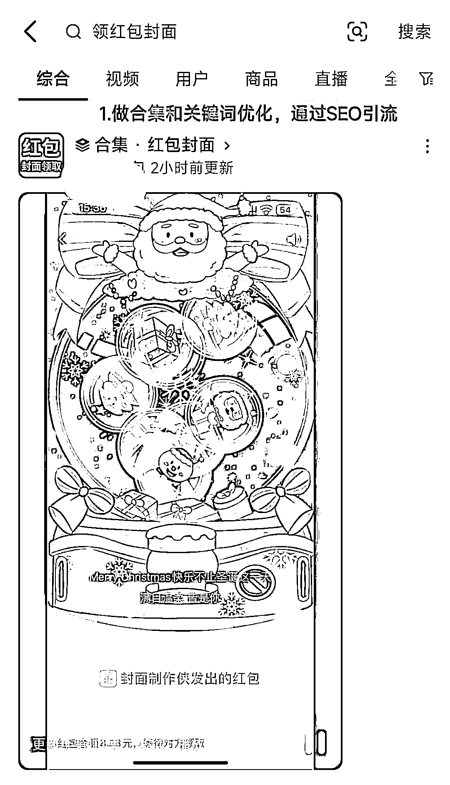
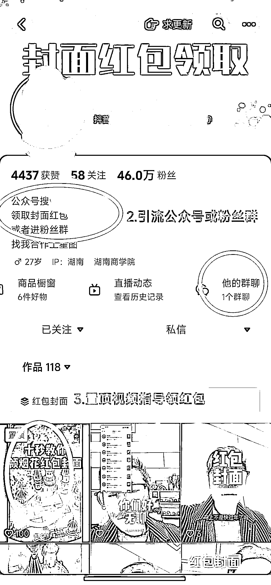

# 完全自动化的红包封面引流路径，抖音+公众号实现自动化引流变现

> 原文：[`www.yuque.com/for_lazy/xkrm14/gpdq08wn8cizwyhl`](https://www.yuque.com/for_lazy/xkrm14/gpdq08wn8cizwyhl)

作者： 徐 Ken

日期：2023-12-12

点赞数：**78**

* * *

正文：

最近在研究红包封面项目，发现一个完全自动化的引流路径，特意跑了一遍对方的流程，大概内容如下:
1.在抖音持续发布视频，通过关键词和视频合集，做好 SEO 优化，当前已经 46 万粉。（如图一） 2.通过抖音简介和粉丝群引流到公众号（如图二）
3.在公众号挂上红包封面商城链接和详细的领取红包封面教程，实现自动化引流变现。（如图三）
美中不足是缺少引流私域的动作。如果在公众号文章以及自动回复中提供（企业）微信，将粉丝引流到私域，以后可以用更多项目进行转化变现。

* * *

评论区：

徐 Ken : 多谢亦仁大大🙏🏻

* * *

公众号懒人找资源，懒人专属群分享