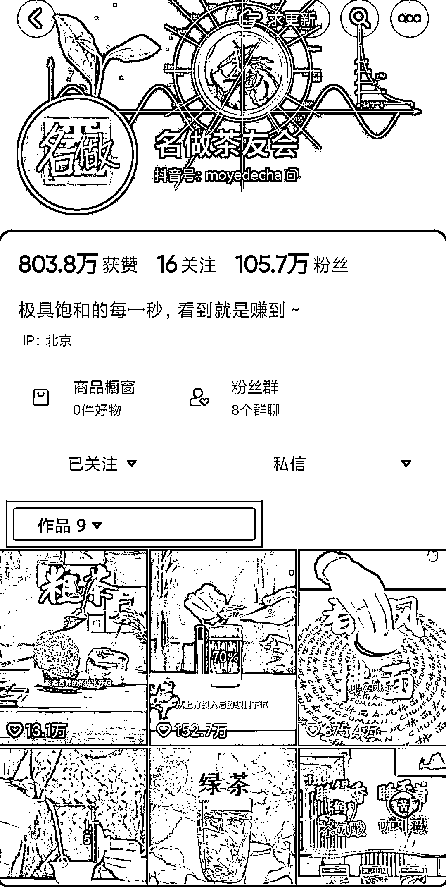
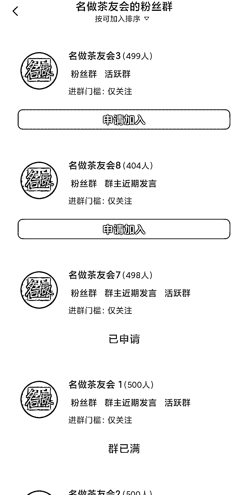

# 借势导流，博主吸粉 105 万，用科普+茶叶+ae 打造多元化变现模式

> 原文：[`www.yuque.com/for_lazy/xkrm14/nggaxtazpi94z4xe`](https://www.yuque.com/for_lazy/xkrm14/nggaxtazpi94z4xe)

作者： 银老板

日期：2023-12-14

点赞数：**74**

* * *

正文：

这个博主只发了 9 个作品，吸粉 105 万。
他的内容模型是把小赛道和大赛道相结合，从而达到借势和导流的目的，同类型的还有:做饭+情感、修车+情感等，各位圈友可以借鉴和学习。
用好这个内容模型，大部分赛道都可以轻松起号和突破瓶颈，顺势抓住流量密码。
说回这个博主，他是把科普+茶叶+ae 进行相结合，辐射到的用户群体更加宽广。因为在抖音对科普感兴趣的人，肯定比那些对茶叶、对 ae 感兴趣的人多得多。
而博主的内容形式，包含了饮茶、冲泡、口味、工艺、技巧等各个系列，从而又精准地覆盖了茶文化的各个等级群体。
我没有做数据监控，以下仅仅是通过肉眼看到的：博主大概是 7-10 天更新一条，评论区很活跃，一半在讨论茶文化，一半在讨论 ae，目前没有直播和带货，但是有 8 个粉丝群，7 个已经满员。
基于以上的内容分析，博主的变现方式非常的多元化，甚至可以做到 S2B2C 的模型，以下是我的个人想法，仅供参考:
①、电商:橱窗带货，或者直播带货，各种茶叶或者茶具。 ②、课程:《茶礼大师班》、《ae 入门到精通》等。 ③、服务:认养茶园、茶叶品鉴会、线下沙龙等等
④、社群:茶叶圈子，比如知识星球、比如高端交流群。 ⑤、培训:孵化一系列茶老板做 IP 矩阵，一起做大市场。

* * *

评论区：

徐 Ken : 好认真！向你学习！

银老板 : [奋斗][奋斗]

云七 : 会不会是不好的隐藏起来了

银老板 : 可以自己去监控[阴险]

刘皇叔 : 没有隐藏，你算一下赞数就知道了

稳一手 : ae 是指 adobe 那个？

* * *

