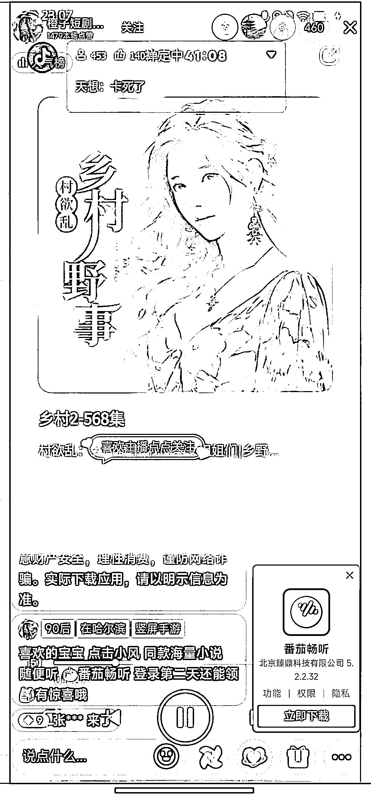
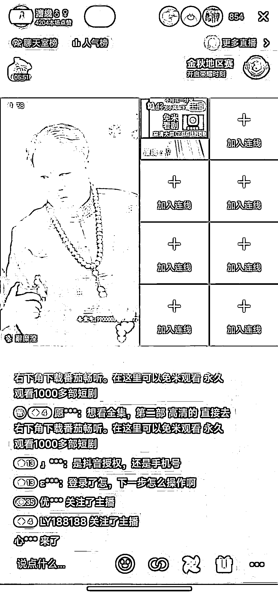

# 无人直播番茄畅听，引导用户下载 APP 获得收益，矩阵操作可回本

> 原文：[`www.yuque.com/for_lazy/xkrm14/yafrntp9aaunnz7e`](https://www.yuque.com/for_lazy/xkrm14/yafrntp9aaunnz7e)

作者： 徐 Ken

日期：2023-12-14

点赞数：**76**

* * *

正文：

无人直播番茄畅听的小说或短剧，刷到两个直播间，在线人数分别是 460 人（图一）和 854 人（图二），引导用户点击直播间的小风车，下载番茄畅听 APP 获得收益。
顺藤摸瓜，咨询了做这块业务的朋友，拉新一单 12 元左右，还给我发了收益截图（图三）以及矩阵操作图（图四）。
如果做这个项目，可以购买实名抖音号进行矩阵化操作，一个号的成本 400 左右，从图三的收益截图看，如果能起号，回本问题不大。现在临近寒假，学生有更多的空闲时间，小说和短剧会迎来一个爆发期，值得尝试。

* * *

评论区：

文少 : 优秀啊

徐 Ken : 撸起袖子加油干😂

辰安 : 图三这收益图是很多个号的统计吗？

徐 Ken : 没有具体问。应该是一行数据对应一场直播。

能量菌 : 这个怎么操作的啊？

徐 Ken : 我没有操作过，估计是无人直播那一套流程，看看航海手册，注意规避封号风险。

惟乔 : 有授权渠道可以推荐一下吗

文少 : 我这有番茄畅听的星图直播任务码

* * *

公众号懒人找资源，懒人专属群分享