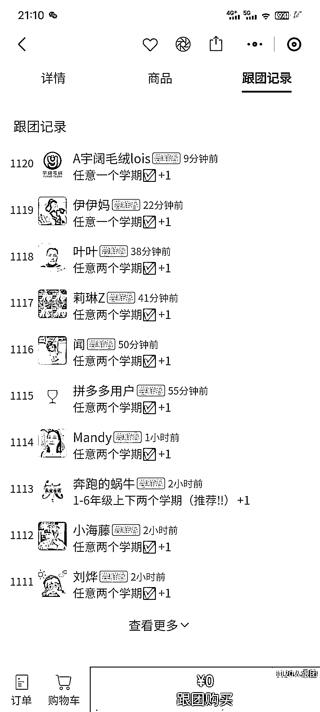

# 小学资料账号销量高达 80 单-天，每天利润超过 5000 元

> 原文：[`www.yuque.com/for_lazy/xkrm14/la8tnacabcvmtbzn`](https://www.yuque.com/for_lazy/xkrm14/la8tnacabcvmtbzn)

作者： 三番

日期：2023-12-12

点赞数：**69**

* * *

正文：

做小学资料的矩阵号，大量账号铺上去，按照他快团团的销量估算了下，一天 80 单，一单 60~200，一天 5000+的利润，这如果在算上微信收款，可能要逼近 6000 一天。

* * *

评论区：

侯海锋 : 账号叫啥

小涛 : 根据关键词就能搜到

佐敦道 : 准备买了到小红书搞起

牧言木语 : 没搜到

三番 : 这个号

三番 : 还是有些难度的，小红书现在抓资质很严，如果上图书资质，成本还是有点高

牧言木语 : 谢谢[玫瑰]

* * *

公众号懒人找资源，懒人专属群分享