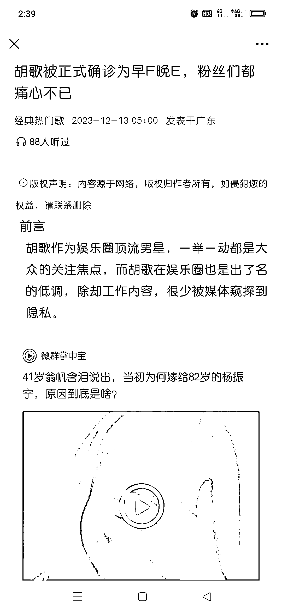
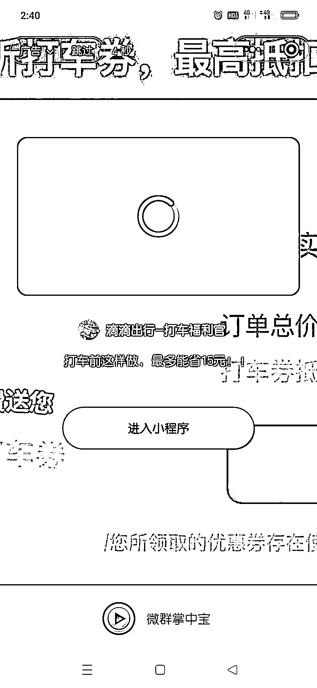
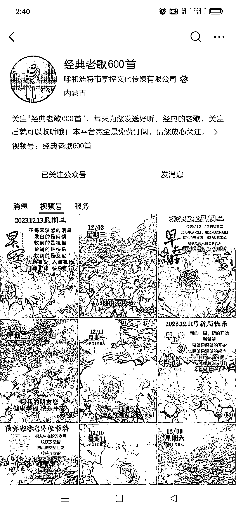

# 老年人爱听的经典老歌，视频号大流量赛道+后端小程序变现

> 原文：[`www.yuque.com/for_lazy/xkrm14/suzg7dp9qurdaal0`](https://www.yuque.com/for_lazy/xkrm14/suzg7dp9qurdaal0)

作者： 高远

日期：2023-12-13

点赞数：**70**

* * *

正文：

视频号大流量赛道+后端小程序变现，适合个人，小微工作室。 账号:经典热门歌（经典老歌） 内容：老年人爱听的歌曲。 承接：公众号
变现：公众号 8 篇文章，首条推送娱乐内容+微群掌中宝小程序，小程序开屏，文章看完都需要点击广告。其余都是推送视频，底部停留广告。
美中不足：没有建立粉丝群，通过社群二次变现。 同类型的还有一个祝福号，大流量，导入公众号小程序变现。

* * *

评论区：

高远 : 也有一些账号是纯靠创作者分成计划在搞，但容易掉，不如这个稳定，这个不足就是没拉粉丝群，接广告，接老年人课程，导粉等这些变现更高。

亿安 : 这种小程序是怎么做的？

高远 : 圈友应该有专门做这个的，可以搜索一下，实在不行，可以淘拼定制一个模板小程序站。也可以先建粉丝群，有了群，变现方式就不止小程序这一种了。

* * *

公众号懒人找资源，懒人专属群分享