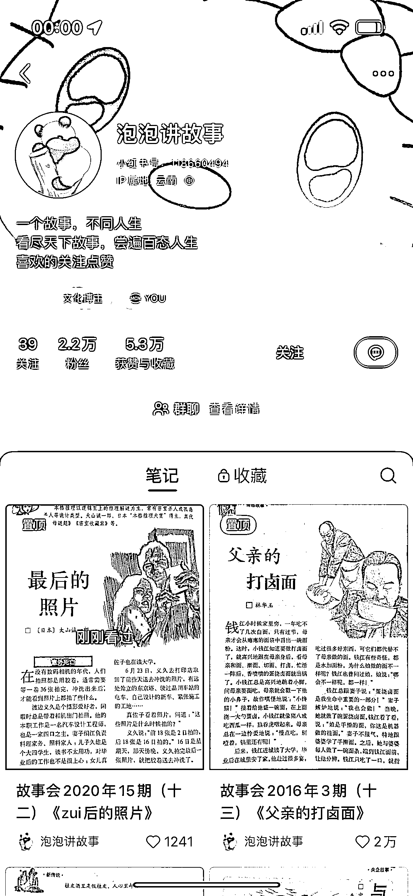
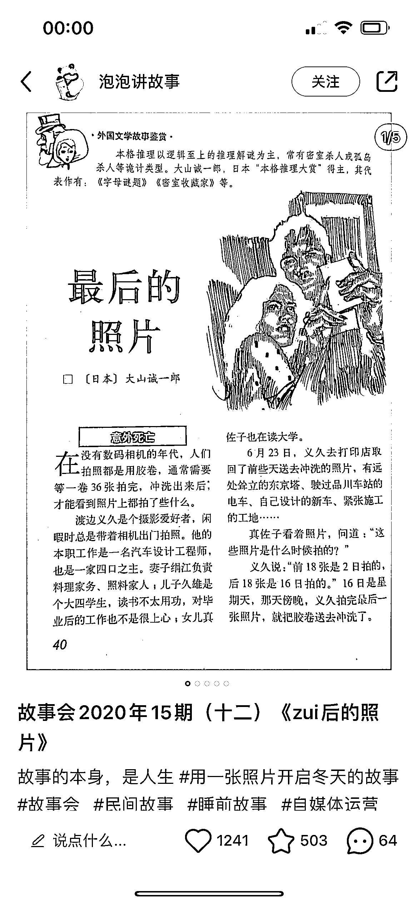
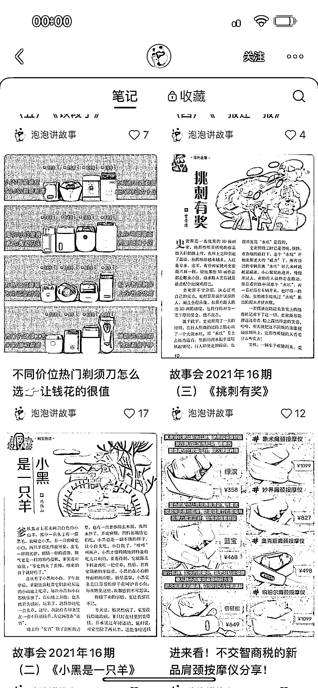

# 通过故事会书拍照发布，，一个月可获广告费 5-6K，还可带货实体书籍

> 原文：[`www.yuque.com/for_lazy/xkrm14/wope5fqyp0vtns50`](https://www.yuque.com/for_lazy/xkrm14/wope5fqyp0vtns50)

作者： 饲养员

日期：2023-12-11

点赞数：**62**

* * *

正文：

把故事会书里的内容分期拍照发布，账号垂直，200 条内容涨了 2.2 万粉，一个月接图文广告至少可以得广告费 5-6K。可以做矩阵，衍生到其他书记垂直发布，例如老版本的漫画：老夫子，多啦 A 梦，等等……起号之后短时间内纯考广告费也是一笔不错的收入，还可以带货实体书籍。
唯一缺点就是版权问题，不知道会不会被投诉下架。

* * *

评论区：

阿陌 : 真的可行

饲养员 : 行动吧

* * *

