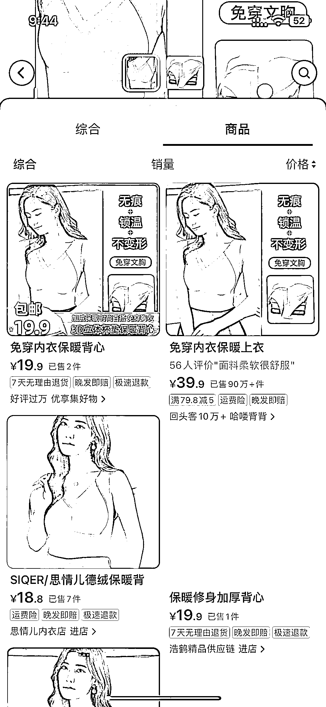
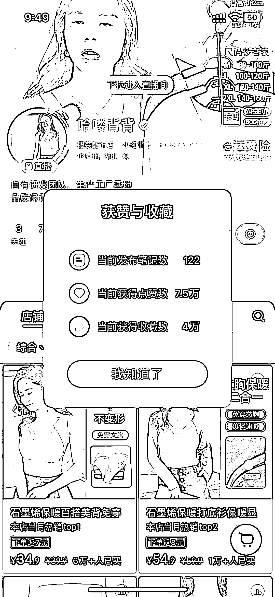

# 抖音销量 92.8 万，小红书 6.1 万，持续增长中的保暖衣背心，满足女性新奇特需求

> 原文：[`www.yuque.com/for_lazy/xkrm14/fpsil2gguebgkhb3`](https://www.yuque.com/for_lazy/xkrm14/fpsil2gguebgkhb3)

作者： Luna

日期：2023-12-11

点赞数：**44**

* * *

正文：

这家店卖这款保暖衣背心抖音目前是是 92.8 万，小红书是 6.1 万，销量还在持续增长中，能满足喜欢新奇特的女性需求，1688 也能找到货源

* * *

评论区：

叶声 : 小红书她是付费打的，11 月 10 日进场，付费打免费，一个月干到销量 7 万+。现在进场已经晚了，最佳时期是 9 月进场。1688 的货大部分是缺货状态，并不是现货

Luna : 小红书不单单只有她自己在卖，1688 能找到货源的

叶声 : 是可以卖，但是一个销量已经 7 万+的头部在那，而且还是付费打，而且 12 月都已经过一半了，市场还剩多少容量留给新号？而且免费的头部也有一个销量 1.4W+，她是 9 月进场的，最早也是搬运哈喽背背抖音的号，爆了后换成自己原创拍摄。剩下在进场的新号大部分都是搬运混剪哈喽背背的，纯靠自己拍视频做起来的根本没有。我意思是，时机上，从需求度和竞争度以及应季产品进场时机上，现在都已经不是最佳时机。至于货源，能找到和能稳定提供现货是两码事，从双十一开始就一直缺货，那段时间 1688 没有一家有现货，全部排单，工厂现货都是保供哈喽背背先，以及一些线下门店，其它渠道都缺货。现在 8803 款缓解了一些，但是 8805 部分码数依然缺。

* * *

