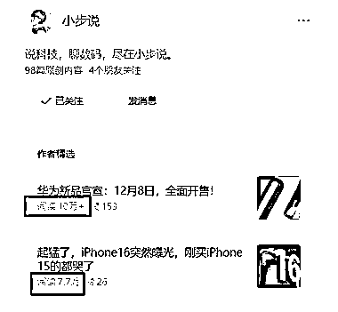
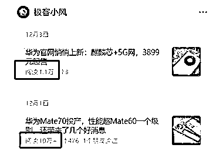
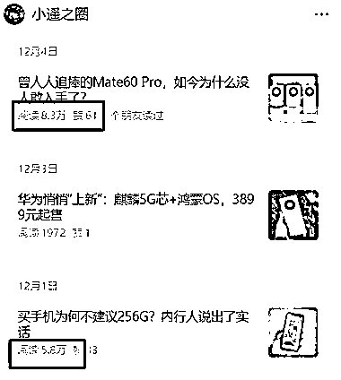
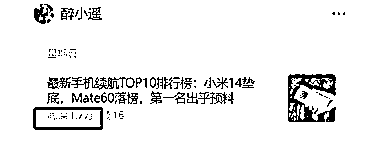

# 公众号流量主的新赛道：手机品牌成为大品牌的突出表现

> 原文：[`www.yuque.com/for_lazy/xkrm14/xkkn973ikk4ss54k`](https://www.yuque.com/for_lazy/xkrm14/xkkn973ikk4ss54k)

作者： Wheels

日期：2023-12-12

点赞数：**101**

* * *

正文：

公众号流量主，新的赛道分享：数码类，尤其是手机品牌，大品牌尤其突出，如苹果，华为，可以再搞一波，基础流量破万很正常，每周会出 2-3 篇 10w+，数码类收益 1w 阅读平均在 200 收益。

* * *

评论区：

* * *

