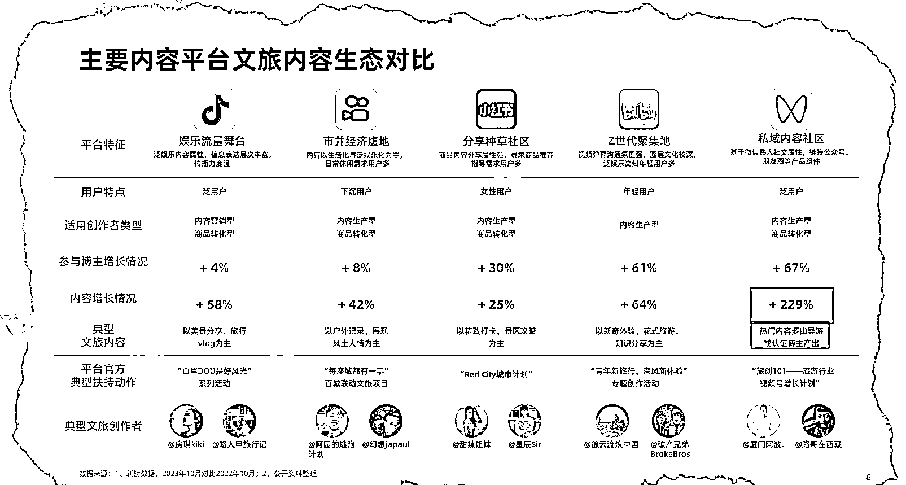
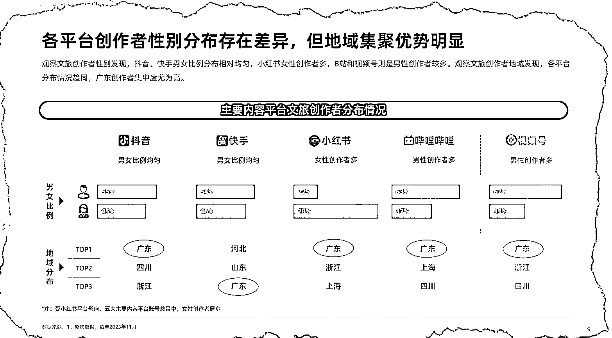
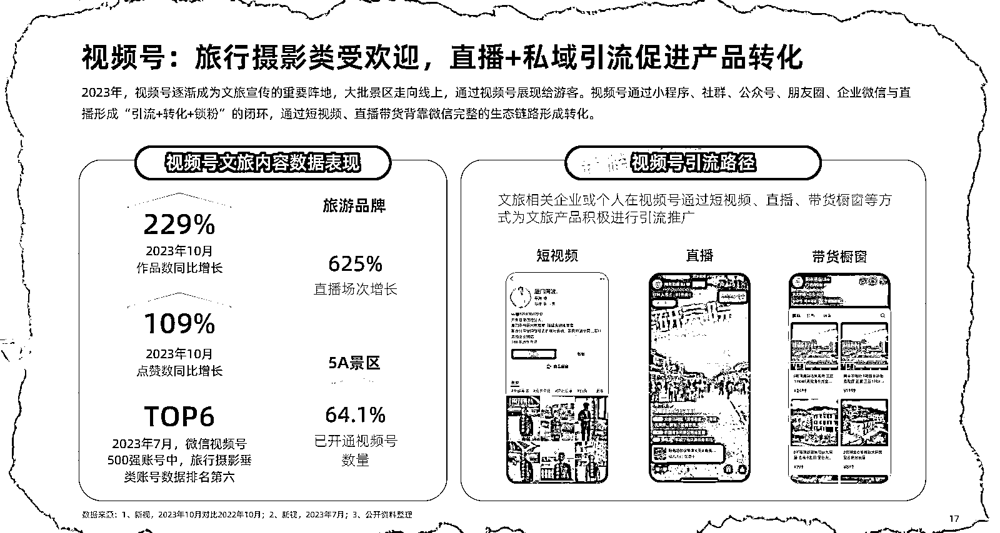

# 视频号旅游赛道，内容增长 200%，布局机会巨大

> 原文：[`www.yuque.com/for_lazy/xkrm14/gaml9bttuqyrr0ic`](https://www.yuque.com/for_lazy/xkrm14/gaml9bttuqyrr0ic)

作者： 张波

日期：2023-12-14

点赞数：**63**

* * *

正文：

视频号旅游赛道，内容增长 200%，合适的个人/企业可以布局 目前市场：很多旅游公司盯着小红书平台，视频号更适合做旅游的视频。
账号情况：从创作者认证占比来看，视频号文旅账号认证比例最高，达到 34%，抖音、快手跟随其后;认证账号中，五大平台文旅企业机构账号占比均较高，其中小红书企业及机构认证占比最高，其次是抖音和快手。
主要商机：企业或个人在视频号通过短视频、直播、带货橱窗等方式为文旅产品积极进行引流推广。

* * *

评论区：

* * *

公众号懒人找资源，懒人专属群分享