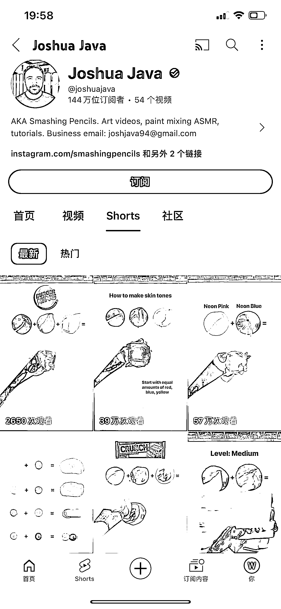
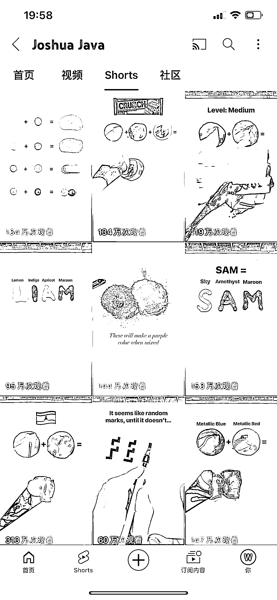
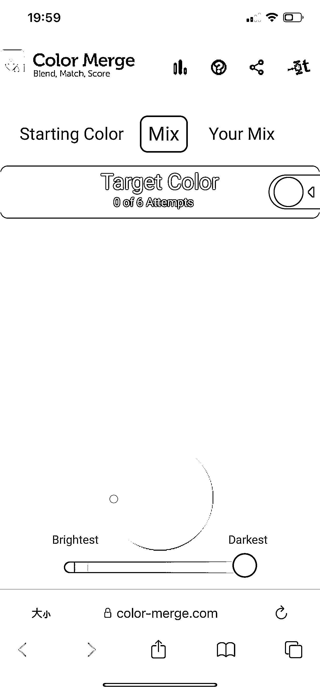

# 短视频 YouTuber 通过颜料混合赚取高收益

> 原文：[`www.yuque.com/for_lazy/xkrm14/yf7gcby2rep3b2gp`](https://www.yuque.com/for_lazy/xkrm14/yf7gcby2rep3b2gp)

作者： 林林 AIGC 写作

日期：2023-12-14

点赞数：**53**

* * *

正文：

靠着“乱涂乱画”的短视频，这个 YouTuber 过去 3 个月涨粉 144 万，54 个视频，总播放量 5.2 亿。
具体看他视频的内容，都是演示不同颜色的颜料混合在一起后的效果，或是一些特殊颜色的配料公式，而且他还有专门引流到独立站（见图 5）变现。
最近的 10 条视频中，播放量六七位数的作品也不在少数。
可见在 YouTube 上创作不带任何地域、文化、宗教、国家的标签的视频，也能与大多数用户产生共鸣，从而让自己更有可能在该平台赚取更多收益。

* * *

评论区：

倪大胖 : 极度舒适

林林 AIGC 写作 : 🤣

* * *

公众号懒人找资源，懒人专属群分享