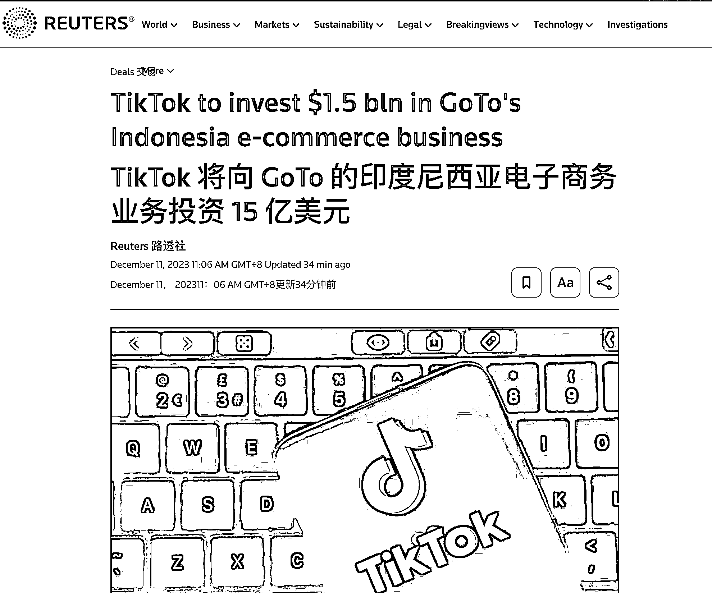

# TikTok 以 8.4 亿美元收购印尼最大电商平台，重启印尼市场

> 原文：[`www.yuque.com/for_lazy/xkrm14/lc75aawiu1td6dxa`](https://www.yuque.com/for_lazy/xkrm14/lc75aawiu1td6dxa)

作者： Mr.Z

日期：2023-12-11

点赞数：**32**

* * *

正文：

TikTok 将以 8.4 亿美元的价格收购印度尼西亚最大的电子商务平台 GoTo PT Tokopedia 75.01% 的股份，并将 TikTok
Shop 的印度尼西亚业务注入扩大后的 Tokopedia 实体。
此前，印尼于 10 月禁止在社交媒体平台上进行在线购物，以保护小型商家和用户的数据，迫使 TikTok 关闭其电子商务服务 TikTok Shop。 此举 TikTok
电商将重启印尼市场

* * *

评论区：

* * *

公众号懒人找资源，懒人专属群分享