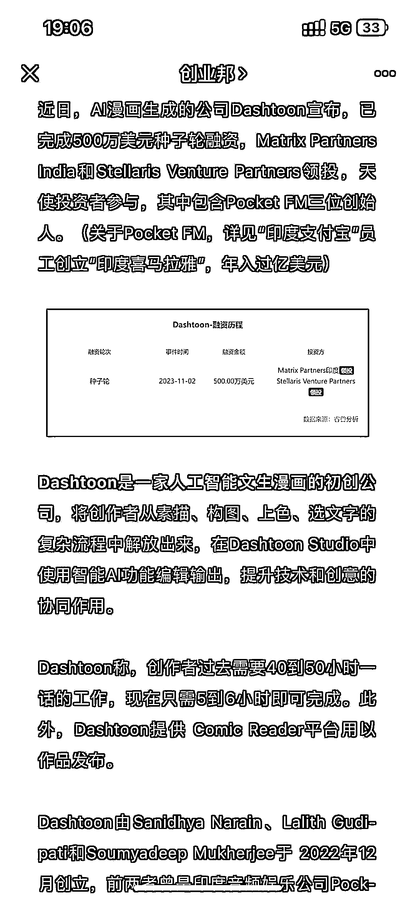

# AI 漫画平台 Dashtoon 完成 500 万美元种子轮融资，提升创作者效率

> 原文：[`www.yuque.com/for_lazy/xkrm14/tcvmeb0d3gkrcdx9`](https://www.yuque.com/for_lazy/xkrm14/tcvmeb0d3gkrcdx9)

作者： 顺势而为

日期：2023-12-12

点赞数：**37**

* * *

正文：

AI 漫画平台，拿了 500 万美元种子轮融资 近日，AI 漫画生成的公司 Dashtoon 宣布，已完成 500 万美元种子轮融资，Matrix Partners
India 和 Stellaris Venture Partners 领投，天使投资者参与，其中包含 Pocket FM 三位创始人。
Dashtoon 是一家人工智能文生漫画的初创公司，将创作者从素描、构图、上色、选文字的复杂流程中解放出来，在 Dashtoon
Studio 中使用智能 AI 功能编辑输出，提升技术和创意的协同作用。
Dashtoon 称，创作者过去需要 40 到 50 小时一话的工作，现在只需 5 到 6 小时即可完成。此外，Dashtoon 提供 Comic
Reader 平台用以作品发布。

* * *

评论区：

* * *

公众号懒人找资源，懒人专属群分享