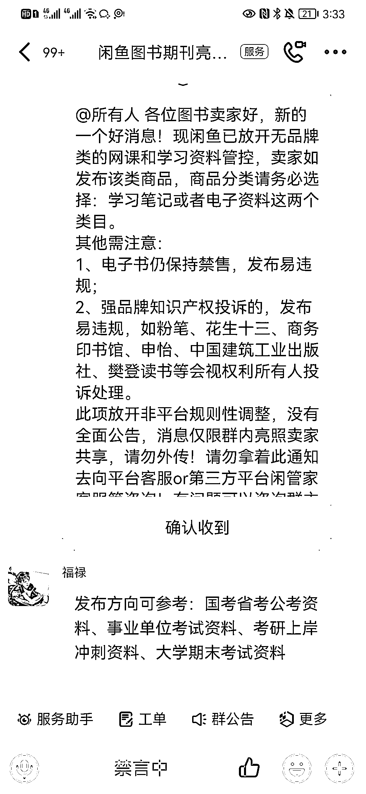
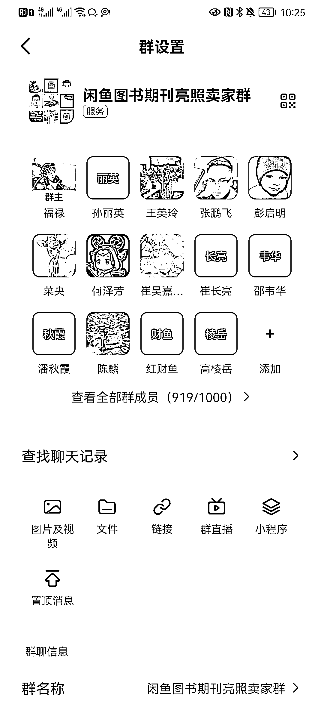

# 闲鱼放开无品牌虚拟课程和学习资料管控，利好考试备考者

> 原文：[`www.yuque.com/for_lazy/xkrm14/ql04trys1n3rvb3c`](https://www.yuque.com/for_lazy/xkrm14/ql04trys1n3rvb3c)

作者： 付付

日期：2023-12-11

点赞数：**94**

* * *

正文：

闲鱼虚拟冲啊！！！闲鱼之前一直对虚拟资料管控严格，今天官方通知，闲鱼已放开无品牌类的网课和学习资料管控。消息是图书类目下有出版物亮照的闲鱼官方运营放出的消息，群是老瞿之前做闲鱼二手书入的官方运营群，确保是官方运营。
消息没有全面公开，所以就存在一个信息差！ 利好：无版权的虚拟课程、资料 发布方向：国考省考公考资料、事业单位考试资料、考研上岸冲刺资料、大学期末考试资料
需要注意： 1、电子书仍保持禁售，发布易违规；
2、强品牌知识产权投诉的，发布易违规，如粉笔、花生十三、商务印书馆、申怡、中国建筑工业出版社、樊登读书等会视权利所有人投诉处理。

* * *

评论区：

书豪 : 牛逼，兄弟

Rio : 谢谢

骷比絨 : 闲鱼聊天界面发送百度网盘链接怎么还会被提示“闲鱼禁止站外交易行为”

风澜 : 今天信福禄，明天就违规，天天信福禄，喜提小黑屋

付付 : 我也没实操，这个信息是官方运营放出来的

老船长李阳 : 不行啊，我卖账号会员今天刚违规

老瞿 Qu : 官方是官方的，就是闲鱼有时候搞不懂，官方杀疯了，自己说的话也乱杀，哈哈[呲牙]，不过应该是趋势了

* * *

公众号懒人找资源，懒人专属群分享