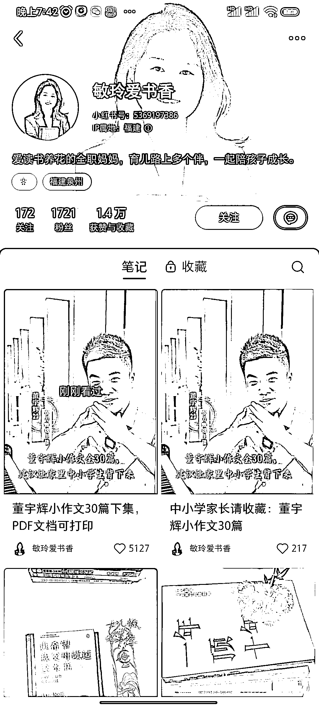

# 小红书账号通过董宇辉小作文电子档引爆涨粉，评论区求分享

> 原文：[`www.yuque.com/for_lazy/xkrm14/sob9f7gceomqmk7n`](https://www.yuque.com/for_lazy/xkrm14/sob9f7gceomqmk7n)

作者： 黑铁

日期：2023-12-21

点赞数：**120**

* * *

正文：

这个小红书账号通过收集董宇辉小作文做成电子档的图文笔记涨粉超快，两条笔记涨粉 1700 多，评论区全是求分享，可引流也可带图书类目商品。

* * *

评论区：

小 Q : 整理也是种很优秀是能力

肖深刻 : 这些人要这个小作文是干什么用

张云金 _GISer : 看不看再说，先屯着，万一看呢[呲牙]

小白脸 : 有阅读需求，阅读兴趣引流！

知新 : 大概就像感动中国的颁奖词一样，中学生都得背，作文用的上。我之前还了解到有人整理人民日报的文章，也是给初高中生参考写作文。

肖深刻 : [抱拳]

三尚 : 666

* * *

