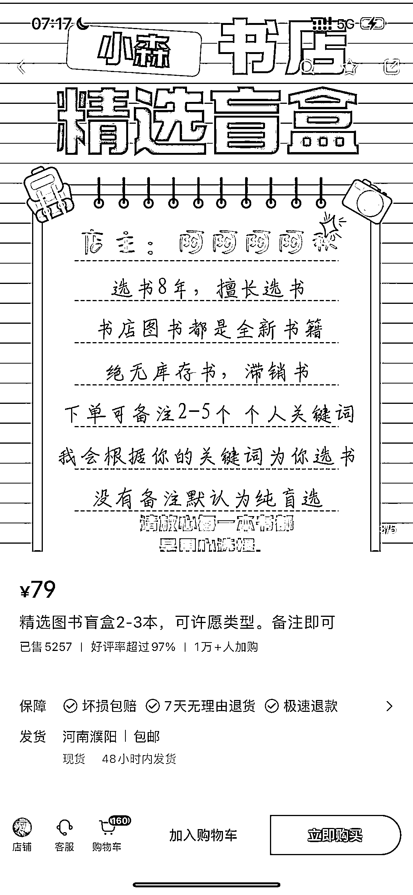

# 实体书店搬上小红书，推出可备注的盲订书，为线下书店带来新增量

> 原文：[`www.yuque.com/for_lazy/xkrm14/kpfeobbdg6vkcntu`](https://www.yuque.com/for_lazy/xkrm14/kpfeobbdg6vkcntu)

作者： 颜若一

日期：2023-12-19

点赞数：**76**

* * *

正文：

实体书店搬到小红书线上卖可备注的盲订书 客户备注指定大方向，具体书籍由店主选，既有盲盒的惊喜，也不会选到不喜欢的书，大大帮线下实体书店体迎来新增量
“半盲盒”概念还能延伸到其他品类，完成捆绑销售

* * *

评论区：

颜若一 : 感谢亦仁老师[玫瑰]

* * *

