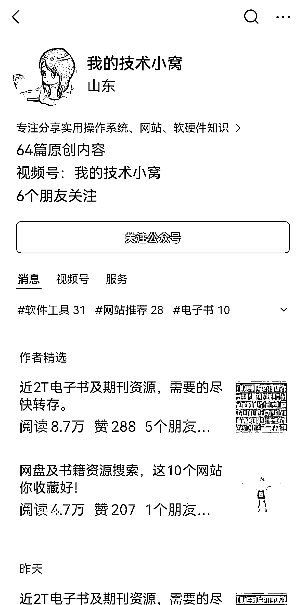

# 高阅读量的公众号，留言区热闹非凡，比小红书引流更可靠

> 原文：[`www.yuque.com/for_lazy/xkrm14/ush54dedaspm62xx`](https://www.yuque.com/for_lazy/xkrm14/ush54dedaspm62xx)

作者： 兰心

日期：2023-12-20

点赞数：**101**

* * *

正文：

送资料的公众号，阅读量上万，留言区炸锅了，比小红书引流香多了，还不用担心封号。

* * *

评论区：

咔咔〖私人号〗 : 为什么前几天 3000 阅读量，最近 10w+了，没看出来是怎么裂变的

兰心 : 去看看

小涛 : 推流

兰心 : 感谢亦仁大大！

小刀 : 抖音里边有一类是电脑高手人设的账号： 视频内容是“一招搞定 windows 激活码”，“跟领导请假，领导只能点同意按钮”这种类型的。
粉丝数据量很好，在 200w 上下的号有好几个。 变现的方式是卖 python 课程，但是变现效果一直都不好。
如果结合送资料公众号的形式做引流，开流量主变现的方式可以尝试一下。

兰心 : 厉害

空性 : 这种被出版社盯上要赔钱的，触犯人家版权

* * *

