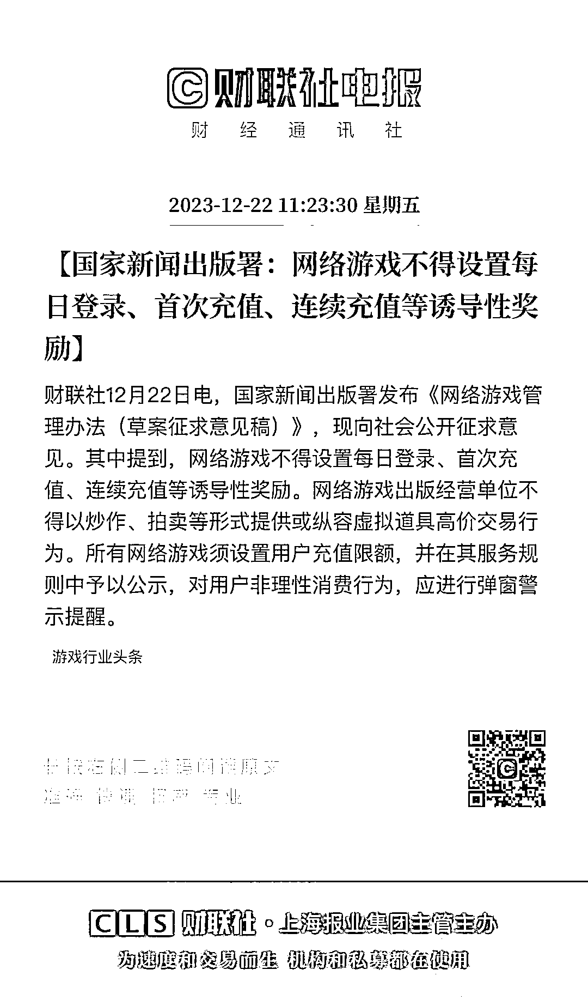
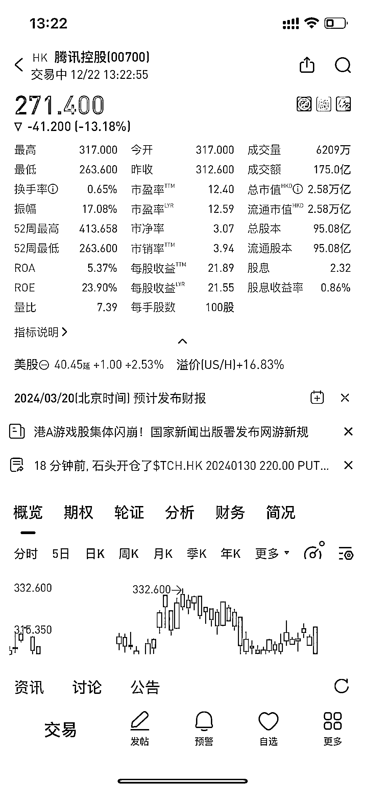

# 互联网支柱领域又折了一个行业：游戏。

> 原文：[`www.yuque.com/for_lazy/xkrm14/iiphbe5egpxkcwem`](https://www.yuque.com/for_lazy/xkrm14/iiphbe5egpxkcwem)

作者： 嗯

日期：2023-12-22

点赞数：**78**

* * *

正文：

互联网支柱领域又折了一个行业：游戏。 江平先生告诉我们：对于个人权利，法无禁止皆可为；对于国家权力，法无授权皆禁止，从人类企业形态的丰富多样性就可窥豹一斑。

* * *

评论区：

三尚 : 666

金九渊 : 征求草案探探市场反馈

不够勇敢. : 是否可以抄底了？

龙川章 : 政策是持续的，别抄到半山腰

* * *

