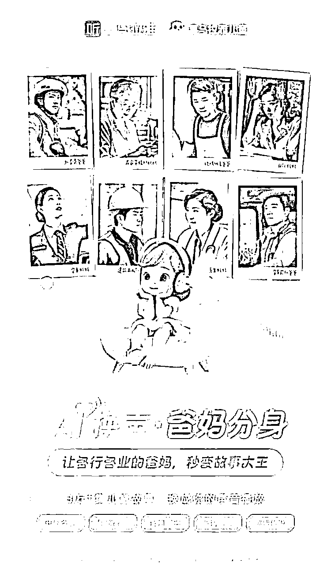

# 喜马拉雅上线了 AI 语音替换功能，解放父母双手

> 原文：[`www.yuque.com/for_lazy/xkrm14/mdbrng8xcff3aotf`](https://www.yuque.com/for_lazy/xkrm14/mdbrng8xcff3aotf)

作者： Leo

日期：2023-12-22

点赞数：**75**

* * *

正文：

喜马拉雅上线了 AI 语音替换功能，解放父母双手，很赞的 AI 落地方式： 【AI 换声·爸妈分身功能亮相喜马拉雅有声之夜，服务家长更深度参与亲子共读】
为满足家庭亲子共读需求，喜马拉雅儿童引入全新服务——AI 换声·爸妈分身功能，让各行各业的爸妈们瞬间成为故事大王。该创新服务旨在提供更个性化的亲子共读体验，通过将家长的声音融入儿童故事中，拉近亲子之间的联系。该功能 12 月 20 日亮相喜马拉雅有声之夜（喜马拉雅年度发布会暨峰爆榜颁奖典礼）。
新功能利用 AI 技术将家长的声音嵌入喜马拉雅儿童庞大的故事库，涵盖中外名著、侦探故事、诗词国学、童话寓言、神话传说等，总计超过 3 万个故事。

* * *

评论区：

三尚 : 666

Leo : 谢谢～

* * *

