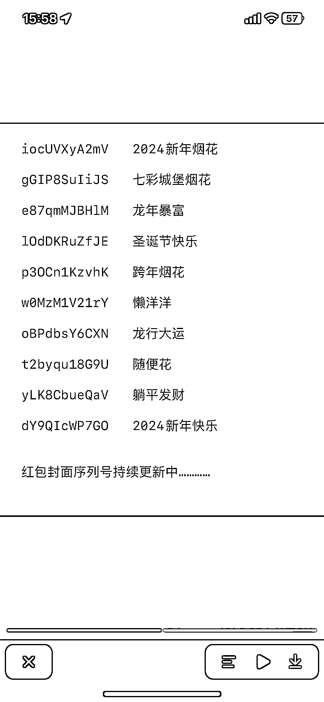
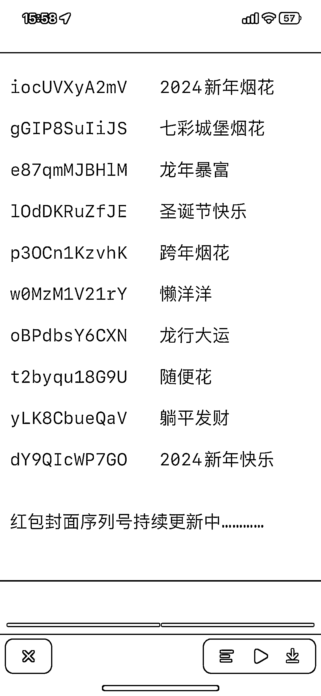
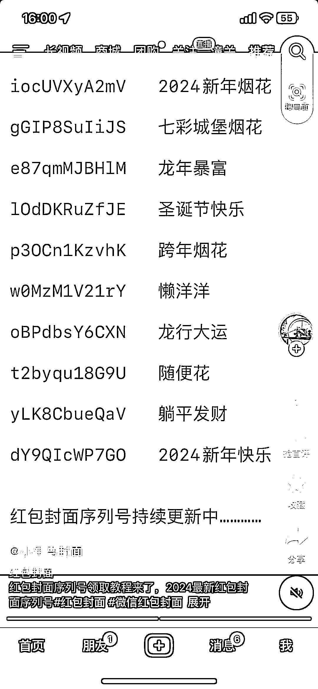
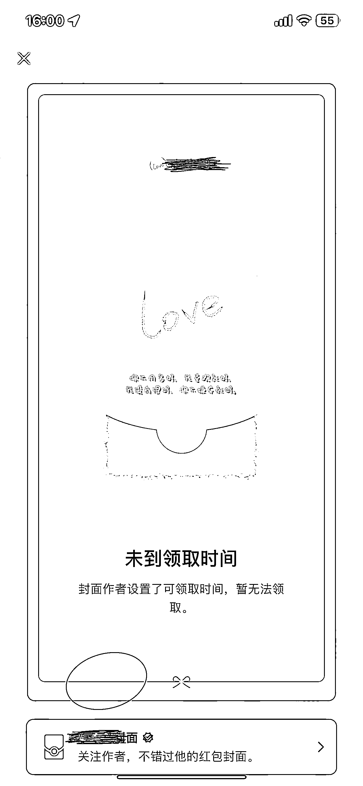
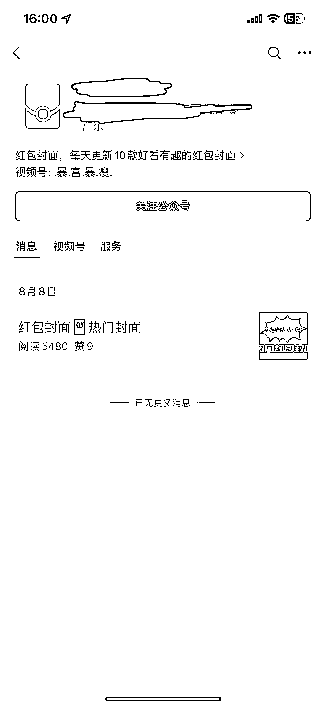

# 学习微信红包引流模式，抖音尝试发送未到领取时间的红包码

> 原文：[`www.yuque.com/for_lazy/xkrm14/kqd2k5cxwm02u69m`](https://www.yuque.com/for_lazy/xkrm14/kqd2k5cxwm02u69m)

作者： 之势

日期：2023-12-18

点赞数：**70**

* * *

正文：

最近微信红包很火，这种引流模式可以学习。 1.抖音发送用不成的红包码（未到领取时间） 2.用户输入后直接显示封面红包作者 3.关注公众号 跳转红包商店

* * *

评论区：

天花板讲武德 : 6

之势 : [太阳][太阳][太阳]

* * *

