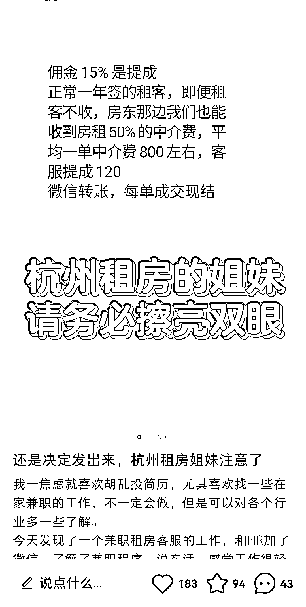
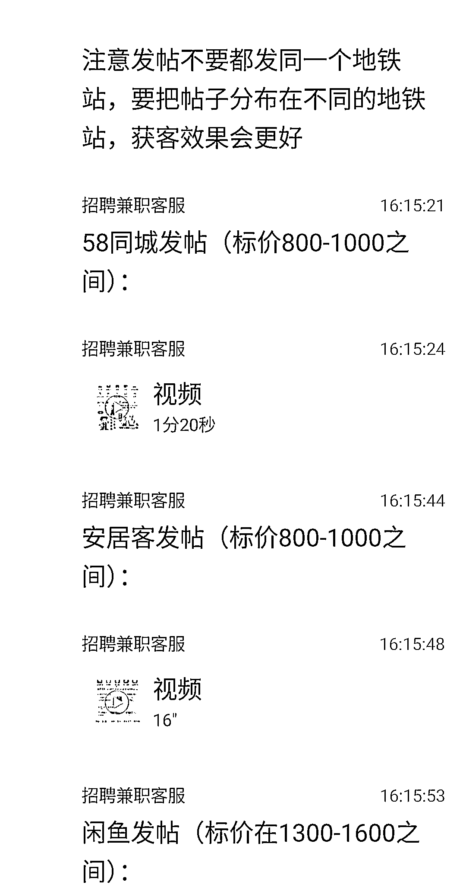
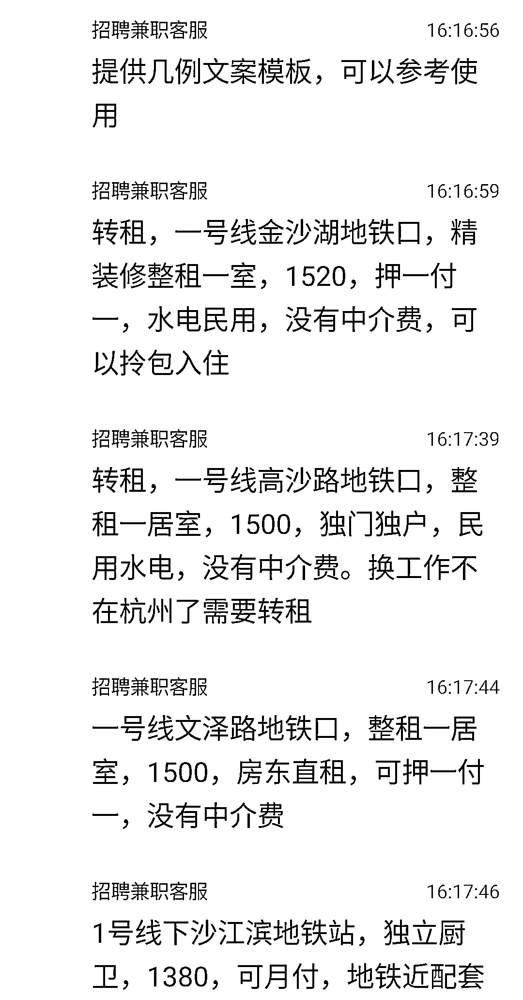
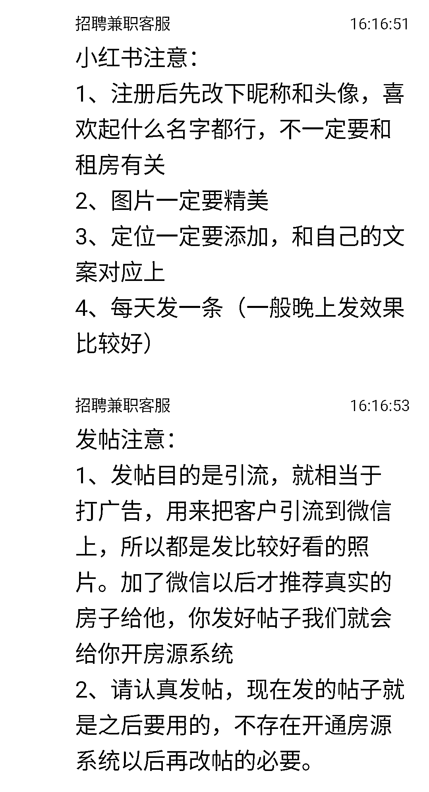

# 租房中介利用伪装租客的方式引流获客，操作精细化运营

> 原文：[`www.yuque.com/for_lazy/xkrm14/sfcd013bgog95v1k`](https://www.yuque.com/for_lazy/xkrm14/sfcd013bgog95v1k)

作者： 邓 致远

日期：2023-12-18

点赞数：**55**

* * *

正文：

还是太卷了，引流获客的操作都这么精细化运营了。 租房中介在招聘软件以招“兼职客服”的名义让别人伪装成转租的租客，然后按成交拿佣金。
内在逻辑类似素人分发，但这里的素人换成了“伪装的租客”，可以理解成虚假的种草。 都已经流程化了，想必效果还不错。
最后两张应该是真实种草，和兼职发帖无必然联系。但是原理是一样的。

* * *

评论区：

发达 : 这个引流获客思路可以借鉴，但是在租房领域确实损人不利己！

* * *

