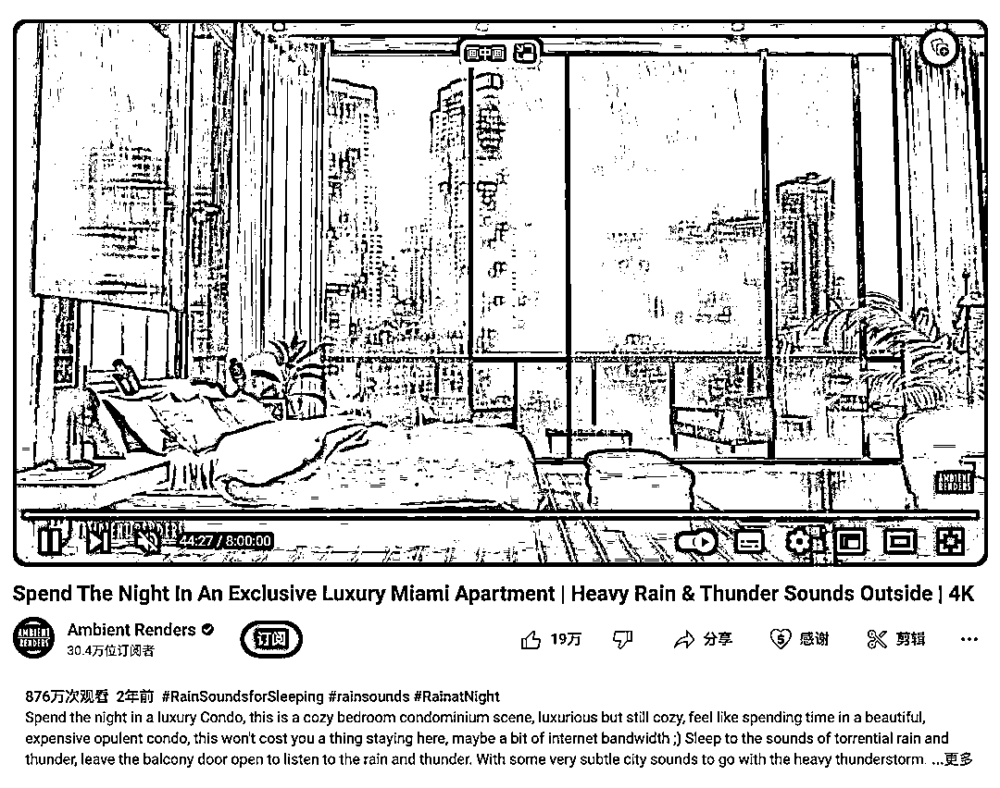

# 舒缓治愈系列视频在 YouTube 上获得高播放量

> 原文：[`www.yuque.com/for_lazy/xkrm14/xcw8eamlp8t3lagw`](https://www.yuque.com/for_lazy/xkrm14/xcw8eamlp8t3lagw)

作者： 邵小光☀️

日期：2023-12-21

点赞数：**103**

* * *

正文：

youtube 一种治愈系列的视频，很舒服的场景配上舒缓音乐，和一些细微的变化，比如雨水划过窗户。两年前的视频 但是播放量很高
用 motionleap 就能制作了，原图可以找 GPT 生成。（圈友有写过相关的文章） 收益来源：油管广告

* * *

评论区：

看好你 : 我也刷到啦 打算做一个看看

小白脸 : 情感

三尚 : 666

yyioo : 前几年圣诞夜的流量也很火

静 : 是哪篇文章？圈友写的？

三尚 : 666

小王 : 一个博主说一个月能达到 1w 美金广告收入[呲牙]

* * *

公众号懒人找资源，懒人专属群分享