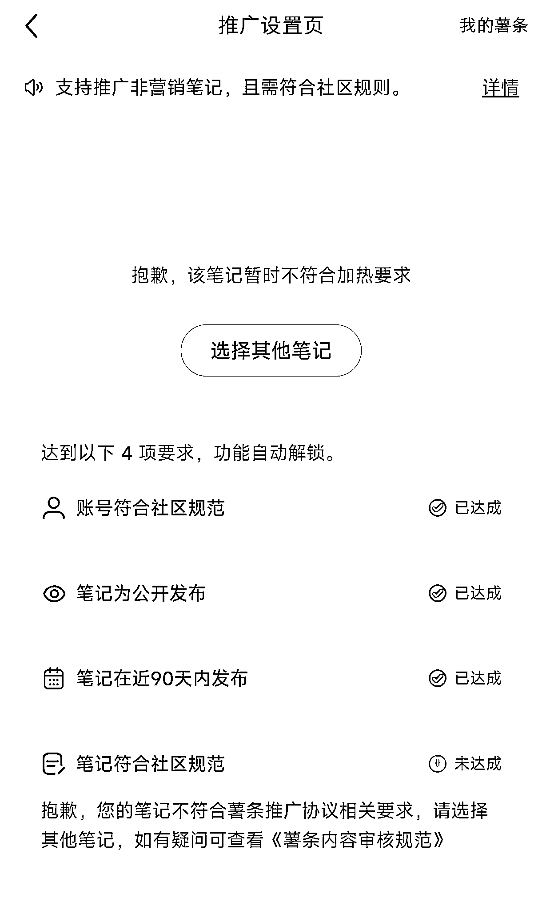

# 小红书资料引流号，解决笔记违规问题，可用薯条推广

> 原文：[`www.yuque.com/for_lazy/xkrm14/mlhgtyv8dablzgu7`](https://www.yuque.com/for_lazy/xkrm14/mlhgtyv8dablzgu7)

作者： 周老师 spark

日期：2023-11-27

点赞数：**59**

* * *

正文：

小红书资料引流号，我做的是数学号，很多笔记都没法薯条推广，这样就是笔记违规了，不会被推荐。但是如果你用这个账号开个虚拟店，把笔记挂上商品后，就能够用薯条推广了。
并且，你发任何笔记目前实测不会违规。各位做资料号的可以试试。

* * *

评论区：

夏林 : 我也做了一个初中数学号，一个月被封 2 次，但是流量还行。

周老师 spark : 引流号，流量越好，越容易违规，早晚 dead，目前开店是可以避免违规，而且店铺客服沟通页，也可以引流

唐少 : 怎么开虚拟店

朋瑞 : 我在小红书发的流量好差，最开始被提示无资质，账号废了，后来注销重新来流量也不行，我都没引流[捂脸]

周老师 spark : 正常开店流程，品类选照片

周老师 spark : 现在引流打击的就是厉害，但是那流量差，可以继续发的，只要不违规，但是只要流量特别好，就很容易违规，

朋瑞 : 如果不引流会违规吗？

* * *

公众号懒人找资源，懒人专属群分享