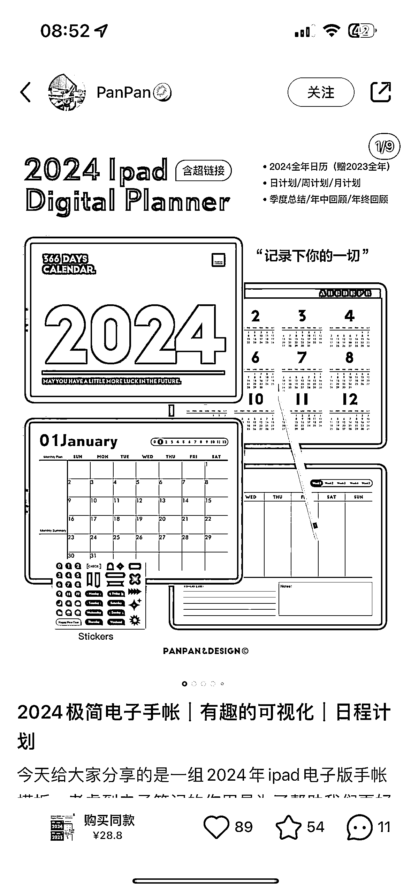
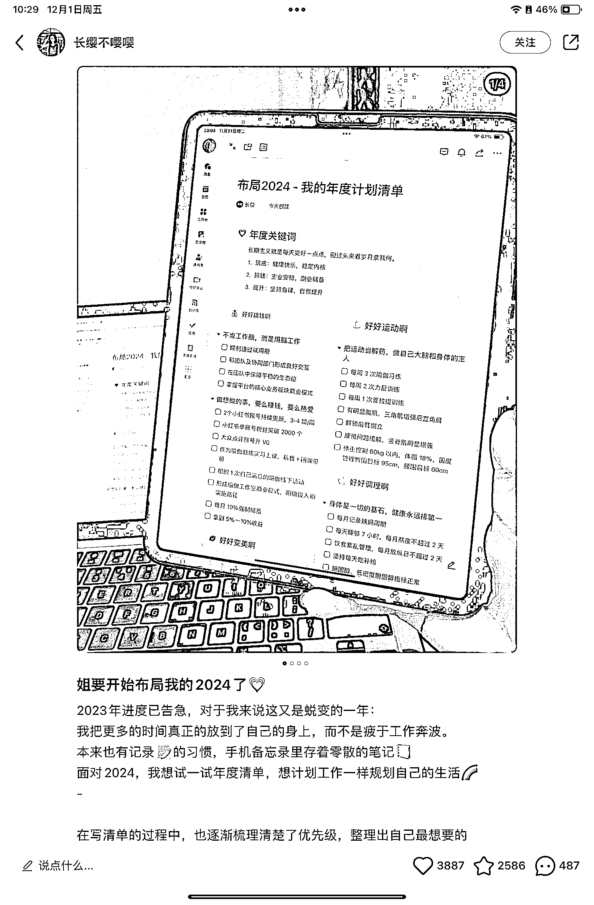
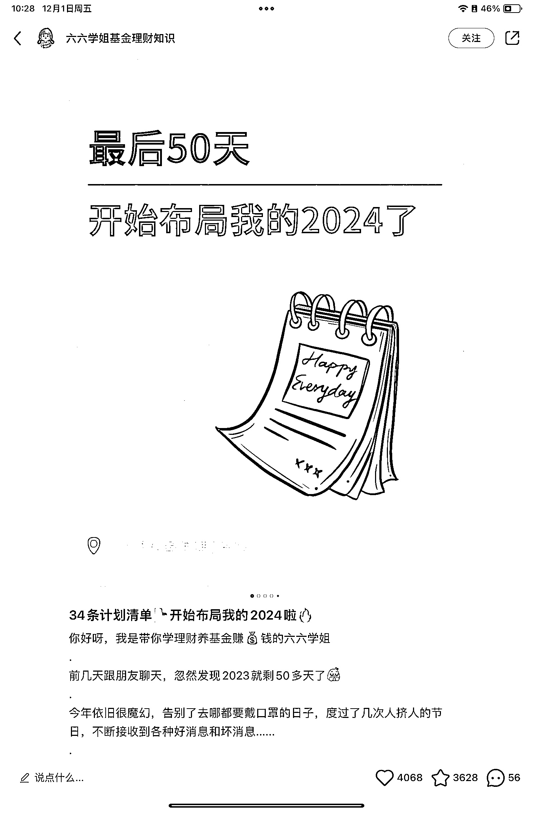
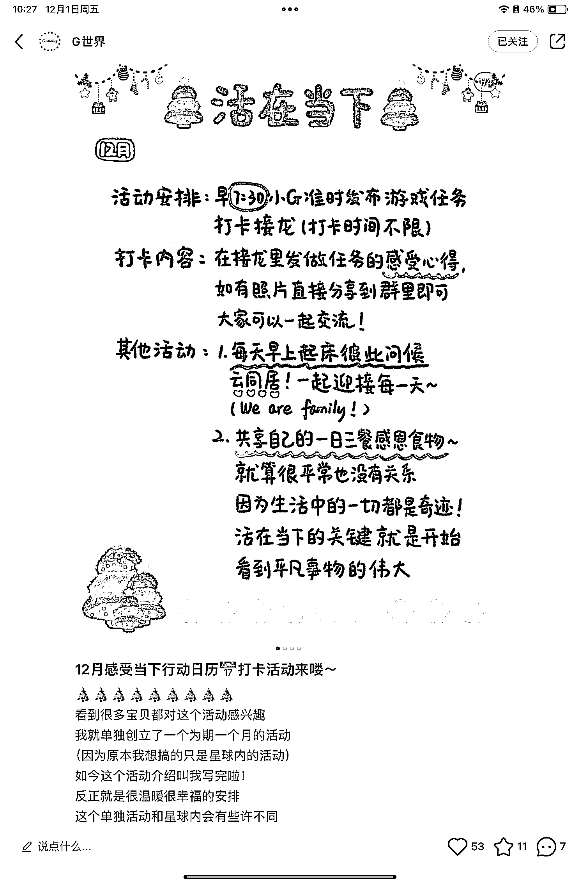

# 小红书年度计划笔记火爆，挂车卖实体手帐和付费模板成新赚钱方式

> 原文：[`www.yuque.com/for_lazy/xkrm14/elolrfi1xriubzw2`](https://www.yuque.com/for_lazy/xkrm14/elolrfi1xriubzw2)

作者： 杳杳 Cecilia🍥

日期：2023-12-01

点赞数：**68**

* * *

正文：

又到年底了，年度计划相关的主题又开始火了。小红书上有很多年度计划的笔记，可以挂车卖实体手帐和付费模板，或者通过分享免费模板、组织活动等来引流到私域。

* * *

评论区：

* * *

公众号懒人找资源，懒人专属群分享