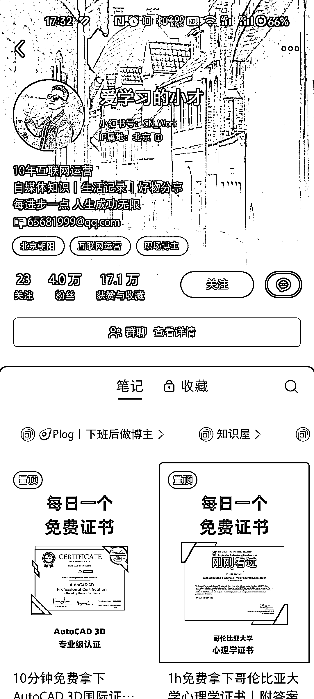
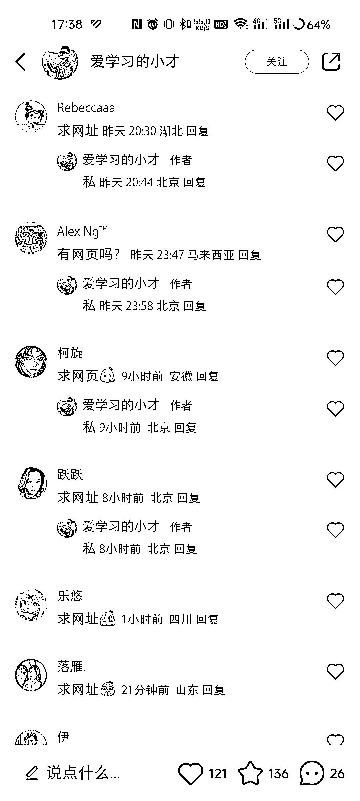

# 小红书《每日一个免费证书》系列涨粉猛，精准用户可做课程分销

> 原文：[`www.yuque.com/for_lazy/xkrm14/dsgtap2w9d96g3w6`](https://www.yuque.com/for_lazy/xkrm14/dsgtap2w9d96g3w6)

作者： 彬🤔

日期：2023-12-01

点赞数：**133**

* * *

正文：

小红书《每日一个免费证书》系列，2 月涨粉 4 万，近 7 天涨粉 1.9 万，很猛！留言区很多求网页的，用户精准，引导私域后期可以做课程分销，账号也有接商业笔记

* * *

评论区：

舒蓬 : 真的是个信息差，10 年前我毕业为了拿这个 cad 证书，当时还花了 1000 块钱，结果今日才明白那个证书免费的

彬🤔 : 感谢亦仁大大🎉

大美 : 哇，这个好酷

阳光男子汉 : 进去看了一个服装设计的，得要钱

文少 : 牛哇这个[强]

* * *

公众号懒人找资源，懒人专属群分享