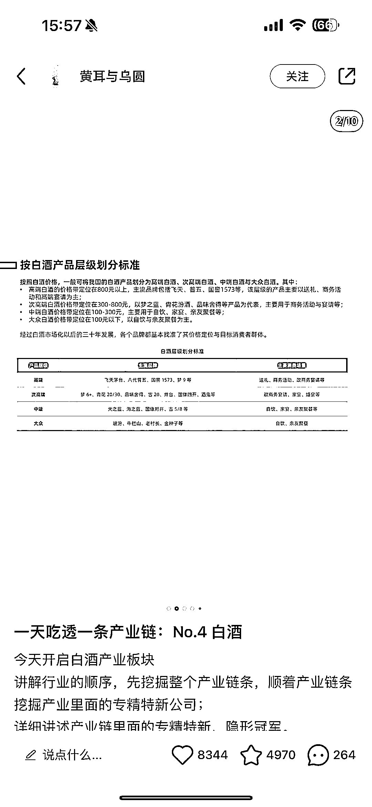

# 十一、月 24 号发布的 PPT 作品，仅 4 条已涨粉 1.7w，评论区引导用户互动

> 原文：[`www.yuque.com/for_lazy/xkrm14/tsotqmd2z8dbxm90`](https://www.yuque.com/for_lazy/xkrm14/tsotqmd2z8dbxm90)

作者： 倾城自律了

日期：2023-11-27

点赞数：**69**

* * *

正文：

11 月 24 号发的作品，到今天 27 号已经涨粉 1.7w，只发了 4 条作品，内容用 PPT 的形式展现出来，最后在评论区引导用户去评论。

* * *

评论区：

认知小窗-认哥 : 昵称➖1 分

youkk : 这个类型要怎么变现呢？

小丽 : 我也想知道

少川 : 1、接广变现：每天认识 XX 系列，本身就是广告，比如每天认识一个化妆品，化妆品本身就是广告，粉丝也很精准，商单很受欢迎，粉丝也不反感；
2、撮合变现：因为流量都很精准，所以，一手托用户，一手托商家，在中间做个中间人，流量还在自己手里，后面有很多相关需求，变现比较容易。
3、流量合作：给有相关资源和需求的人，导流，按照流量结算，比如做的 A 货，市场价一个加思域 30-80/个。 4、还有其他方式，带货/收徒/卖账号都是。
讲完，是不是这么个思路[红包][红包][红包]

艾小飞 : 思路 6

棋道 : PPT 是 AI 吗？

BLUE : 书单号也不少这么做的

* * *

公众号懒人找资源，懒人专属群分享