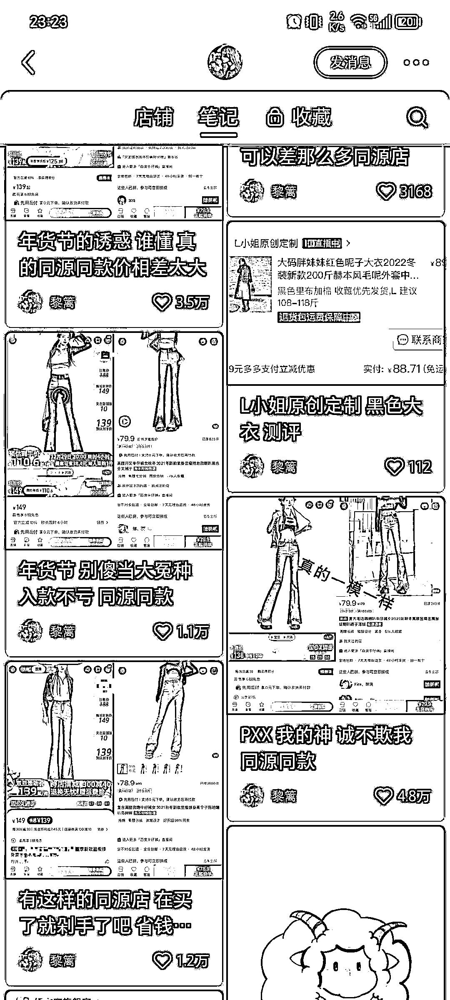
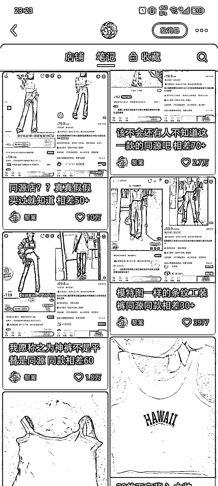

# 素人穿搭博主，高精准粉，爆款类型，图文视频都可做！

> 原文：[`www.yuque.com/for_lazy/xkrm14/zwrpldcpkx1r541g`](https://www.yuque.com/for_lazy/xkrm14/zwrpldcpkx1r541g)

作者： 早早

日期：2023-11-27

点赞数：**64**

* * *

正文：

素人穿搭博主，不露脸，爆款类型，高精准粉，图文视频都可做！
小红书发现的一个超级大爆款，从去年 12 月以为开始发这种实拍拼多多和淘宝的裤子对比图评测（在此之前发的内容很少且流量低），1 年时间涨粉 95 万！
这个博主专做裤子测评，全是精准粉，结合盗坤老师前两天直播间讲的，推荐在抖音做实拍的服装达人，这是纯素人最好借鉴的模式了，定位一个类型，精品女装评测，大码女装评测，学院风评测等等。都可以在抖音做。对素人真的不要太友好！

* * *

评论区：

艾小飞 : 点子很好，她抓住了用户想省钱的心，但刚刚我去看了他的账号，看不到有接广和引流的痕迹，店铺销量 0，我是比较好奇，她是怎么有动力一直在更新的[捂脸]

家有小刘！ : 会不会那家拼多多便宜的就是她的广告

小太阳 : 在抖音也是测评拼多多的货吗？

BLUE : 太有趣了： 1）小红书的爆发 很多人从拼多多或者 1688 拿货去小红书卖货。（咱们航海很多圈友这么做的啊）
2）消费降级，有更便宜的同款我为什么买贵的。PDD 虽然流氓但价格真香 3）提供信息差，帮用户找同款 4）笔记创作和评论区已经形成正反馈
5）两头赚（纯猜测）：链接小红书买家和 PDD 卖家

BLUE : 还有一个有趣的现象：对应的 PDD 单价也有小一百，小红书价格反而成了锚定。

早早 : 嗯嗯，不过这个号在抖音流量不是很大

早早 : 科代表啦！

* * *

公众号懒人找资源，懒人专属群分享