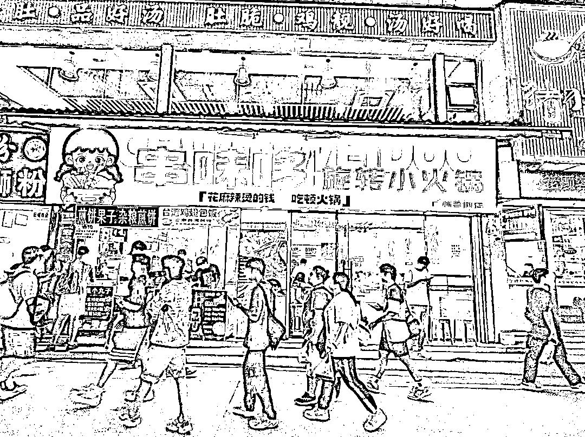
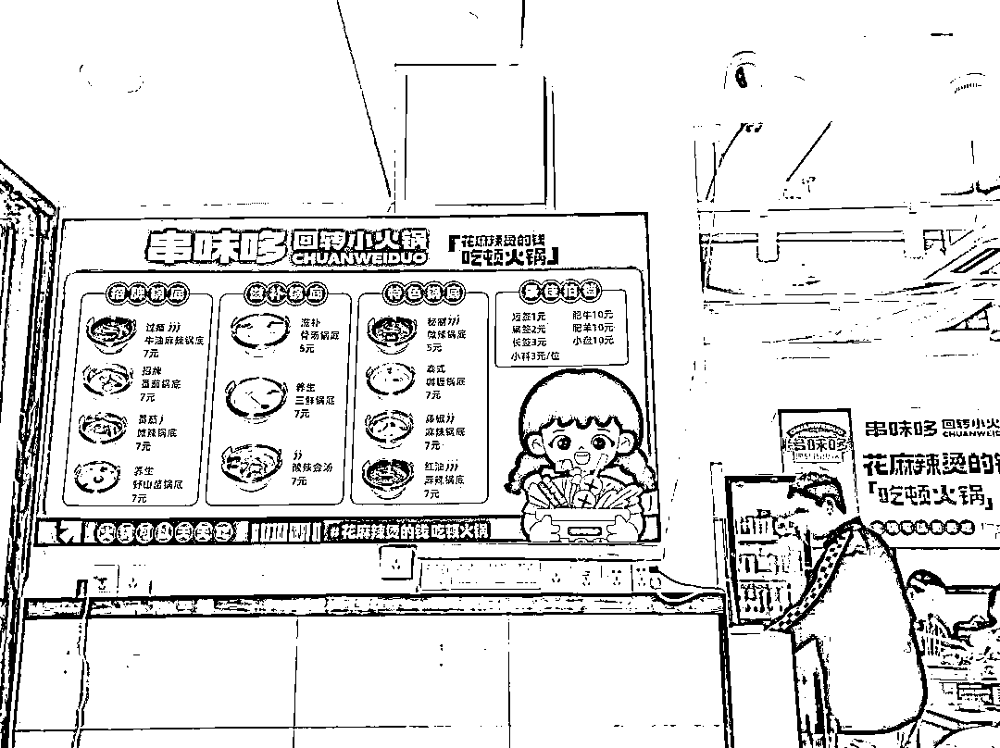
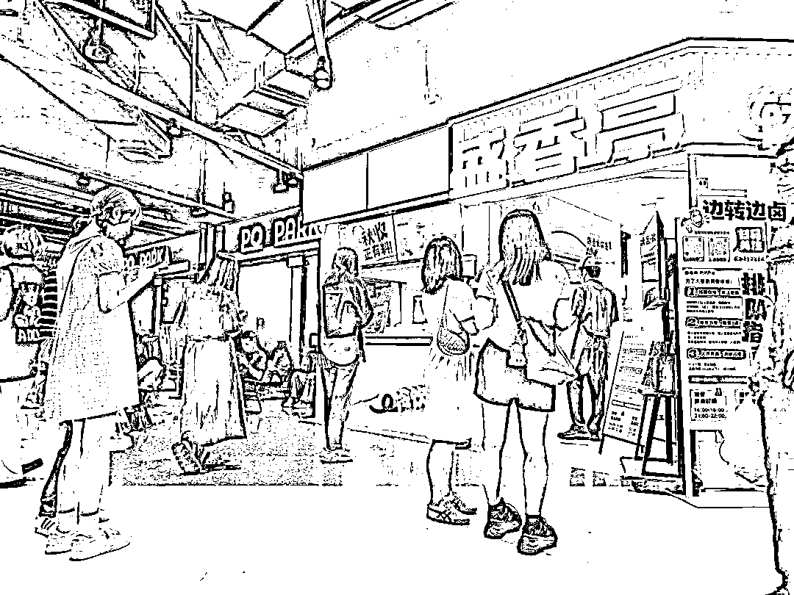
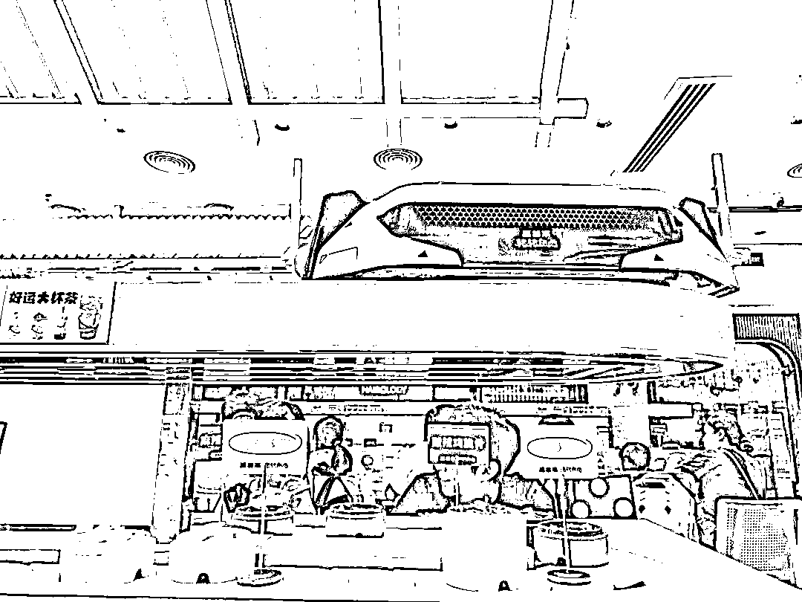
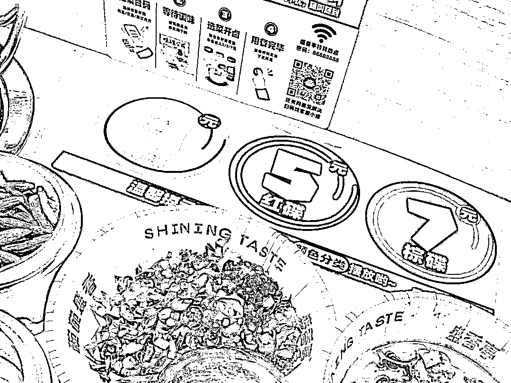
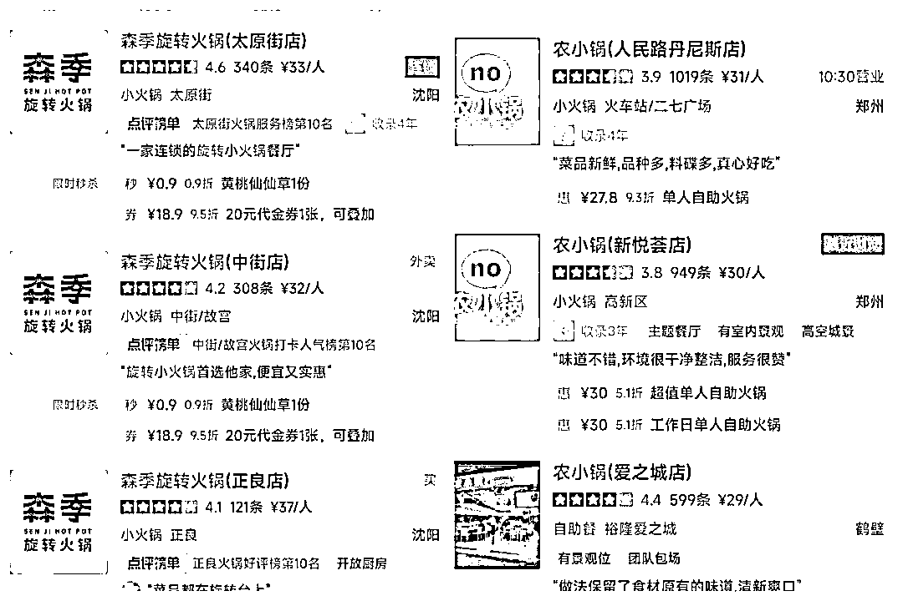

# 人均低至 30 元，年轻人排队吃，旋转小火锅在全国“翻红”

> 原文：[`www.yuque.com/for_lazy/xkrm14/cewuqtphuyqcn6mb`](https://www.yuque.com/for_lazy/xkrm14/cewuqtphuyqcn6mb)

作者： 深圳老刘

日期：2023-11-27

点赞数：**51**

* * *

正文：

人均低至 30 元，年轻人排队吃，一批旋转小火锅在全国“翻红”
广州客村地铁站周边的“串味哆旋转小火锅”，傍晚 7 时许店内已基本坐满，门口也有不少年轻消费者排队，同一条街相隔约 50 米的“艾氏旋转小火锅”门店也排起了长队。
大众点评显示，该店 客单价约 50 元/人。 十多年前，国内一些火锅店借鉴回转寿司的模式，在全国掀起了一阵旋转火锅的风潮。但这股风潮没能维持太久便“过气”了。
与之前相比，如今这批新兴的旋转小火锅（包括回转火锅、转转火锅、转转热卤等）有什么特色？“翻红”的原因是什么？
1、高性价比：客单价低至 30 元，菜品单价低至 1 元 2、菜品丰富可选择多，门店 SKU 普遍超过 30 个 3、环境明亮整洁，装修风格年轻化
小火锅翻红背后的消费趋势是：年轻人需要更实惠、更具性价比的火锅。 旋转小火锅只是这股风潮下率先冒头的“排头兵”，接下来，市场或许出现更多平价的火锅业态。

* * *

评论区：

BLUE : 对比了张亮麻辣烫，感觉除了自煮以外，没多大区别啊

长安未尽 : 我们公司就是做这个的，纯利 40%左右

* * *

公众号懒人找资源，懒人专属群分享